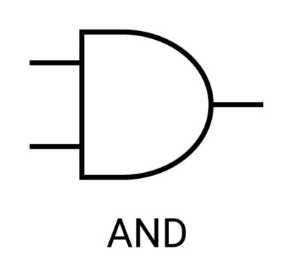

# Logikai ÉS (AND)

A kimenet csak akkor ad vissza 1-et, ha mindkét bemenet 1. Más néven konjunkció.

## Igazságtáblázat
| Bemenet A | Bemenet B | Kimenet |
|----------|----------|--------|
|    0     |    0     |    0   |
|    0     |    1     |    0   |
|    1     |    0     |    0   |
|    1     |    1     |    1   |

## Egyéb jelölés

$A \cdot B$

$A \& B$
