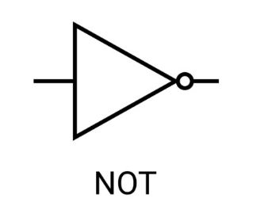

# Logikai NEM (NOT)

A kimenet az bemenet ellentettje. Más néven komplemensképzés.

## Igazságtáblázat
| Bemenet | Kimenet |
|---------|---------|
|    0    |    1    |
|    1    |    0    |

## Egyéb jelölés

$\neg A$

$\overline{A}$

