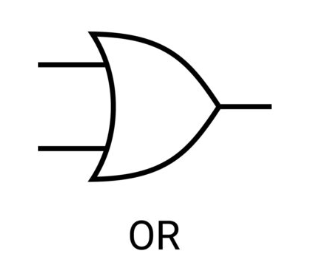

# Logikai VAGY (OR)

A kimenet 1, ha legalább az egyik bemenet 1. Más néven diszjukció.

## Igazságtáblázat
| Bemenet A | Bemenet B | Kimenet |
|-----------|-----------|---------|
|     0     |     0     |    0    |
|     0     |     1     |    1    |
|     1     |     0     |    1    |
|     1     |     1     |    1    |

## Egyéb jelölés

$A + B$

$A \mid B$