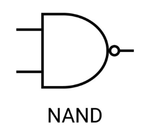

# NEMÉS kapu (NAND)

A kimenet 0, ha mindkét bemenet 1, egyéb esetekben a kimenet 1. Lényegében egy [negált](negalt.md) [és](./logikai-es.md).

## Igazságtáblázat
| Bemenet A | Bemenet B | Kimenet |
|-----------|-----------|---------|
|     0     |     0     |    1    |
|     0     |     1     |    1    |
|     1     |     0     |    1    |
|     1     |     1     |    0    |

## Egyéb jelölés

$\overline{AB}$
