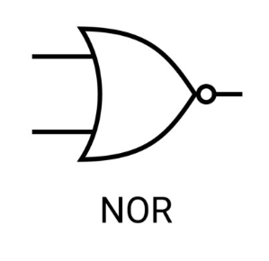

# Logikai NOR (Not OR)

A kimenet csak akkor 1, ha mindkét bemenet 0. Lényegében egy [negált](./logikai-nem.md) [vagy](./logikai-vagy.md).

## Igazságtáblázat
| Bemenet A | Bemenet B | Kimenet |
|-----------|-----------|---------|
|     0     |     0     |    1    |
|     0     |     1     |    0    |
|     1     |     0     |    0    |
|     1     |     1     |    0    |

## Egyéb jelölés

$\overline{A+B}$
