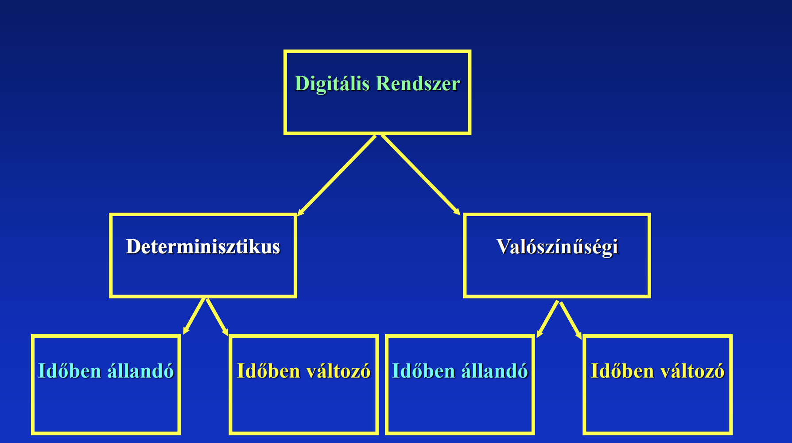
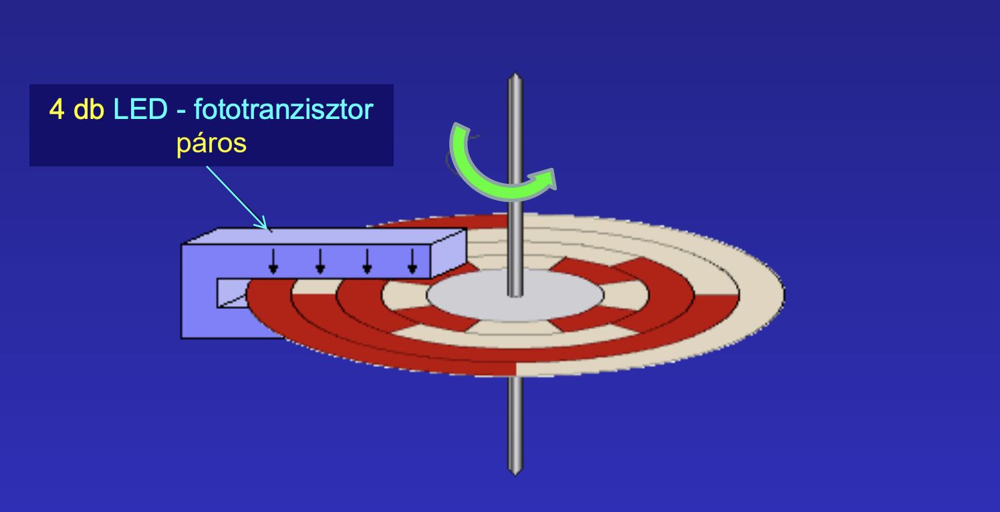

# Elektronika

AUT, Glöckner György
Digitális Technika, Digitális Elektronika tárgy

* portal.vik.bme.hu/kepzes/targyak/VIAUA050
* edu.vik.bme.hu
* https://edu.vik.bme.hu/mod/folder/view.php?id=118967

**Minden labor kötelező** (2 pótolható) - nincs beugró az 5 laborfoglalkozáshoz - az összes feladatot meg kell oldani mérési útmutatóban
2 zh - délután estefele csütörtökön 18-19:30
Félévközi jegy

Programozható áramkörök (FPGA - Field programmable gate array)

## Első előadás
### Analóg és Digitális rendszer

* Rendszer működését bemenő és kimenő jelek közötti kapcsolat adja meg
* Jelátvitel egy átviteli függvénnyel írható le:
    - ha ez egy folytonos transzformáció, akkor analóg
    - ha diszkrét értékek, akkor digitális
* Digitalizált (mintavételezett jel)
    - Kvantálás, felbontás mértéke

|Analóg | Digitális|
|---|---|
|folytonos jel  |  diszkrét érték|
|fokozott zavarérzékenység  |  kevésbé zavarérzékeny |
|folyt. jelek feldolgozhatók | közvetlenül számokkal tud műveletet végezni |
|kevésbé üzembiztos  |  jobban üzembiztos |

### A digitális rendszer leírásának matematikai alapjai       
* Analóg rendszerek - matematikai analízis
* Digitális rendszerek leírása - absztrakt algebra
Absztrakt algebra George Boole általi implementációja: Boole algebra

**Mintavételezési törvény** - a legnagyobb frekvencia kétszeresével kell mintavételezni egy analóg jelet

### Digitális elektronikai tervezés alternatívák ma
* mikrovezérlő + egyebek
* komplex funkcionális blokkok (építőkockák)
* mit tanulunk:
    * alapelvek
    * alapfunkciók
    * alapmegoldások

### Kódolás, kódok
**Fogalma**: 2 szimbólumrendszer elemeinek egymáshoz rendelése

Példák:
    - óvodások jele
    - Neptun-kód
    - Hangjegyek és azok neve

#### 1. BCD kódok (bináris számsor decimális számokhoz rendelése)
NBCD kód (természetes BCD kód)

Tulajdonságai:
- súlyozott
- természetes
- egyértelmű
- 4 bites

nem hibatűrő $\rightarrow$ kiegészítő biteket adunk hozzá (pl paritásjelző bit)

léteznek egyéb súlyozások is

#### 2. Ciklikus kódok
Példa: DC motor forgó tengelyének pozíció érzékelése

Probléma: kiterjesztett NBCD-vel lehetséges nagyon nagy hiba

gray kód: egymás mellett levő szektorokból mindig csak 1 cella változik
