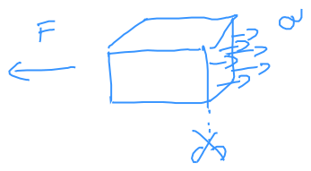

# Normál feszültség
Felületre merőleges

Egyenletesen oszlik el a keresztmetszet mentén (be lehet bizonyítani később)
jele: $\sigma$
$$\sigma = \frac{F}{A} \ \  \left[\frac{N}{m^2}\right]=[\text{Pa}]$$

Ha $\epsilon$ kicsi $\rightarrow$ $A \approx A_0$ 
Pozitív: húzófeszültség
Negatív: nyomófeszültség