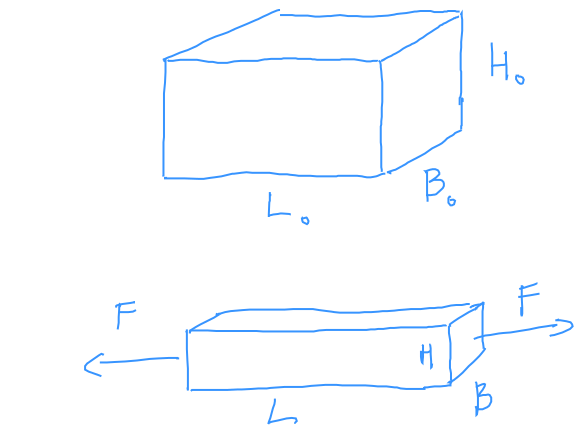

# Rudak gerendák feszültségi állapota

## Normál igénybevétel
Idealizált húzókísérlet

$$ \delta L = L-L_0 $$
$$ \delta H = H-H_0 $$
$$ \delta B = B-B_0 $$

$$ \epsilon = \frac{\delta L}{L_0} $$

Fajlagos megnyúlás (mérnöki alakváltozás)

$$ -1 < \epsilon $$

Keresztirányban $\epsilon_k = \frac{\delta H}{H_0}$

$$ \epsilon_k = \frac{\delta B}{B_0} $$

[Izotrop anyagi](izotrop.md) viselkedés esetén - ez van csak sziltannál.

Engineering strain $\epsilon (< 0.05)$ sziltanban

Logaritmikus (valós) alakváltozás (logarithmic/true strain) $\ln[1+\epsilon]$

Mechanikus feszültség: Gondolatban kettévágjuk a testet: anyagi kényszerkapcsolatokat megszüntettem. Ha teljesíteni szeretném az egyensúlyt, akkor előrek a [normál feszültség](normal-feszultseg.md) fogalmához.
