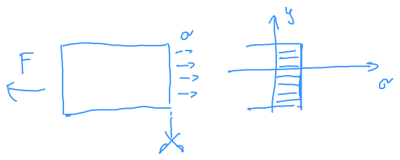

# Rudak gerendák feszültségi állapota

## Normál igénybevétel
Idealizált húzókísérlet:

$$ \Delta L = L-L_0 \newline
    \Delta H = H-H_0 \newline
    \Delta B = B-B_0 $$

**Fajlagos megnyúlás** (mérnöki alakváltozás)
$$ \varepsilon = \frac{\Delta L}{L_0} $$
$$ -1 < \varepsilon $$
Keresztirányban:
 $$\varepsilon_k = \frac{\Delta H}{H_0}$$

[Izotrop anyagi](izotrop.md) viselkedés esetén - ez van csak sziltannál.
$$ \varepsilon_k = \frac{\Delta B}{B_0} $$

Engineering strain $\varepsilon$ - sziltanban ez $(< 0.05)$

Logaritmikus (valós) alakváltozás (logarithmic/true strain) $$\ln[1+\varepsilon]$$

### Mechanikus feszültség: 
Gondolatban kettévágjuk a testet: anyagi kényszerkapcsolatokat megszüntettem. Ha teljesíteni szeretném az egyensúlyt, akkor elérek a [normál feszültség](normal-feszultseg.md) fogalmához.

### 2d ábrázolás

Acél húzódiagramja

$ \sigma_F$ - folyáshatár (initial yield stress)
$ R_m$ - szakítószilárdság (ultimate stress)
\* A szilárdságtan tárgyon belül mi a lineárisan rugalmas szakaszban vagyunk érdekeltek. Itt $\varepsilon << 5%$.

**Keresztirányú deformációk**

$$ \frac{V}{V_0} = \frac{LBH}{L_0B_0H_0} = (1+\varepsilon)(1+\varepsilon_k)^2 = 1 $$
Ebből következnek a nemlineáris dolgok?

Saint-Venant féle elv: A ható erő módja (több pont, egy pont, egyenletes eloszlás) nem számít, ha elég távol van az erőhatás (Csak az összege számít)

Ökölszabály: 

Optikai feszültségvizsgálat