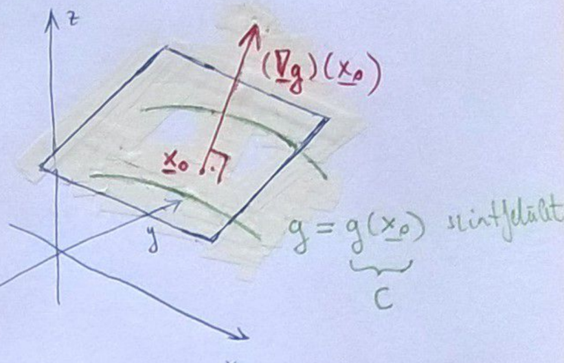

# Többváltozós analízis

# Tartalomjegyzék
1. [Általános tudnivalók](#általános-tudnivalók)
2. [Jelölések](#jelölések)
3. [Definíciók](#definiciók)
4. [Tételek, állítások](#tételek-állítások)
5. [Előadások](#előadások) \
    5.1. [1. Előadás](#1-előadás)
    5.2. [2. Előadás](#2-előadás)

# Általános tudnivalók

# Jelölések
$\mathbb{R}^p$ - $p$ dimenziós valós tér \
$A^C$ - $A$ halmaz komplementere \
$\text{ext } A$ - $A$ halmaz [külső pontjainak](kulso-pont.md) halmaza \
$\text{int } A$ - $A$ halmaz [belső pontjainak](belso-pont.md) halmaza \
$\partial A$ - $A$ halmaz [határpontjainak](hatarpont.md) halmaza \
$\bar{A}$ - $A$ halmaz [lezártja](halmaz-lezartja.md) \
$\text{graph } f$ - $f$ [grafikonja](grafikon.md) \
$\gamma_c$ - $f$ függvény $c$-hez tartozó [szintvonala](szintvonal.md) \
$\Gamma_c$ - $f$ függvény $c$-hez tartozó [kontúrvonala](konturvonal.md) \
$|\vec{x}|$ - $\vec{x}$ hossza \
$d(\vec{x}, \vec{y})=|\vec{x}-\vec{y}|$ - $\vec{x}$ és $\vec{y}$ távolsága
$\text{grad }{f}=\vec{\nabla}f$ - $f$ függvény [gradiens vektora](gradiens-vektor.md)
$f'_x$ függvény $x$ szerinti [parciális deriváltja](parcialis-derivalt.md)
$f'$ függvény [totális deriváltja](totalis-derivalt.md)

# Definíciók
* [Pont környezete](kornyezet.md)
* [Belső pont, belső ponthalmaz](belso-pont.md)
* [Külső pont, külső ponthalmaz](kulso-pont.md)
* [Határpont, határponthalmaz](hatarpont.md)
* [Nyílt halmaz](nyilt-halmaz.md)
* [Zárt halmaz](zart-halmaz.md)
* [Halmaz lezártja](halmaz-lezartja.md)
* [Izolált pont](izolalt-pont.md)
* [Torlódási pont](torlodasi-pont.md)
* [Összefüggőség](osszefuggoseg.md)
* [Tartomány](tartomany.md)
* [Korlátos halmaz](korlatos-halmaz.md)
* [Sorozat határértéke](sorozat-hatarerteke.md)
* [Konvergens sorozat](konvergens-sorozat.md)
* [Függvény határértéke](fuggveny-hatarerteke.md)
* [Függvény folytonossága](fuggveny-folytonossaga.md)
* [Korlátos sorozat](korlatos-sorozat.md)
* [Grafikon](grafikon.md)
* [Kontúrvonal](konturvonal.md)
* [Szintvonal](szintvonal.md)
* [Két út módszer](ket-ut-modszer.md)
* [Parciális derivált](parcialis-derivalt.md)
* [Young tétel](young-tetel.md)
* [Iránymenti derivált](iranymenti-derivalt.md)
* [Érintősík](erintosik.md)
* [Totális derivált](totalis-derivalt.md)
* [Gradiens vektor](gradiens-vektor.md)

# Tételek, állítások
* [+ random allitasok kellenek, amiket felirtunk?]
* [Bolzano-Weierstrass tétel](bolzano-weierstrass.md)

# Előadások
---
## 1. előadás

> ### Félév tematikája
* Többváltozós függvények: $f:\mathbb{R}^p \rightarrow \mathbb{R}$
* Térgörbék: $f:\mathbb{R}\rightarrow \mathbb{R}^p$
* Felületek: $f:\mathbb{R}^2\rightarrow \mathbb{R}^p$
* Vektormezők:  $f:\mathbb{R}^p\rightarrow \mathbb{R}^q$
* Függvénysorozatok/sorok, hatványsorok, Fourier-sorok
* Komplex függvénytani bevezető

> ### $\mathbb{R}^p$ tér topológiája
**Jelölés**: $\vec{x} \in \mathbb{R}^p$

**Def**.: 
* [Pont környezete](kornyezet.md)
* [Belső pontok](belso-pont.md)
* [Külső pontok](kulso-pont.md)
* [Határpontok](hatarpont.md)
* [Nyílt halmaz](nyilt-halmaz.md)
* [Zárt halmaz](zart-halmaz.md)
* [Halmaz lezártja](halmaz-lezartja.md)

**Áll**.: 
* $\text{int } A\subseteq A \subseteq \bar{A}$
* [$\text{ext }A$](kulso-pont.md) mindig [nyílt](nyilt-halmaz.md)
* [$\partial A$](hatarpont.md) mindig [zárt](zart-halmaz.md)
* [$\text{int } A$](belso-pont.md), [$\text{ext } A$](kulso-pont.md), [$\partial A$](hatarpont.md) páronként diszjunkt halmazok
* $\text{int } \ A \cup \text{ ext } A \ \cup \partial A = \mathbb{R}^p$, ha $A \subseteq \mathbb{R}^p$ 

**Példa**: $A=[0;1) \text{ esetén}$
* $\text{int } A = (0; 1)$
* $\text{ext } A = (-\infty; 0) \cup (1; \infty)$
* $\partial A = \{0; 1\}$
* $\bar{A} = [0; 1]$

**Példa**: $A = \{(x, y)\in \mathbb{R}^2: 0<x^2+y^2<1\}$ esetén
* $\text{int } A = A$
* $\text{ext } A = \{ x^2+y^2>1 \}$
* $\partial A = \{ x^2+y^2=1\}\cup \{(0, 0)\}$

**Def**.: 
* [Izolált pont](izolalt-pont.md)
* [Torlódási pont](torlodasi-pont.md)

**Példa**: $A=\{ \frac{1}{n}:n\in \mathbb{N}^p \}$-nak $0$-ban van [torlódási pontja](torlodasi-pont.md)

**Példa**: $A=(0;1]$-nak a [torlódási pontjai](torlodasi-pont.md) $[0;1]$

**Áll**.:
* Véges sok [nyílt halmaz](nyilt-halmaz.md) metszete nyílt
* Akárhány [nyílt halmaz](nyilt-halmaz.md) uniója nyílt
* Véges sok [zárt halmaz](zart-halmaz.md) uniója zárt
* Akárhány [zárt halmaz](zart-halmaz.md) metszete zárt

**Def**.: 
* [Összefüggő halmaz](osszefuggoseg.md)
* [Tartomány](tartomany.md)
* [Korlátos halmaz](korlatos-halmaz.md)

**Példa**: 
* $(1; 3]$ összefüggő
* $A=(0;1) \cup (1;3]$ nem összefüggő, hiszen $B=(0; 1), C=(1; 4)$

**Def**.:
* [Sorozat határértéke](sorozat-hatarerteke.md)
* [Konvergens sorozat](konvergens-sorozat.md)

* [Függvény határértéke](fuggveny-hatarerteke.md)
* [Függvény folytonossága](fuggveny-folytonossaga.md)

**Áll**.: $\lim{\vec{x}_n}=A \Leftrightarrow \forall i<p: (\vec{x}_n)_i\to A_i$

**Példa**:
$\lim_{n\to \infty} \left( \frac{n-1}{n}, \left( 1+\frac{1}{n}\right)^n\right) = (1, e)$

**Áll**.: 
* [Bolzano-Weierstrass tétel](../analizis/bolzano-weierstrass-tetel.md): $\forall$ [korlátos sorozatnak](korlatos-sorozat.md) $\exists$ [konvergens](konvergens-sorozat.md) [részsorozata](../analizis/reszsorozat.md)
* $\mathbb{R}^p$-ben is igaz, hogy $\forall$ [Cauchy sorozat](../analizis/cauchy-sorozat.md) [konvergens](konvergens-sorozat.md)

> ### Kétváltozós függvények

**Def**.:
* [Grafikon](grafikon.md)
* [Kontúrvonal](konturvonal.md)
* [Szintvonal](szintvonal.md)

**Példa**: $f(x, y) = \sqrt{x^2+y^2} = z$, Mi lehet ez?

**Medoldás**:
* Szintvonalak: $\sqrt{x^2+y^2}=c$ - minden szintvonal kör
* Síkmetszés $[x,\ z]$ síkkal, (ekkor $y=0$): $\sqrt{x^2}=|x|=z$
* Tehát minden vízszintes szintvonal kör, és az egyik függőleges egy abszolútérték, így ez egy forgáskúp lesz.

---

## 2. előadás

**Példa**: $\lim_{(x,y)\rightarrow(0,0)}\frac{2xy}{x^2+y^2} = \lim_{(x,y)\rightarrow(0,0)} f(x,y)$

**Def**.:
* [Két út módszer](ket-ut-modszer.md)
* [Parciális derivált](parcialis-derivalt.md)
* [Young tétel](young-tetel.md)
* [Iránymenti derivált](iranymenti-derivalt.md)
* [Totális derivált](totalis-derivalt.md)
* [Érintősík](erintosik.md)
* [Gradiens vektor](gradiens-vektor.md)

**Áll**.:
* $f_{c\vec{v}}' = f_{\vec{v}}'$, ha $c > 0$
* $f'_{-v}(\vec{x}_0)=-f'_{v}(\vec{x}_0)$
* $f$ [totálisan diffható](totalis-derivalt.md) $x_0$ pontban és $f'(\vec{x_0})=\vec{A} \Leftrightarrow \lim_{\vec{x} \rightarrow \vec{x_0}}{\frac{f(\vec{x})-f(\vec{x_0}) - \vec{A}(\vec{x}-\vec{x_0})}{|\vec{x}-\vec{x_0|}}} = 0$

**Áll**.:
Tegyük fel, hogy $f$ [totálisan diffható](totalis-derivalt.md) $\vec{x_0}$ pontban $f: \mathbb{R}^p \rightarrow \mathbb{R}$. Ekkor:
1. $f$ [folytonos](fuggveny-folytonossaga.md) $\vec{x_0}$-ban 
2. $f$ [iránymenti deriváltjai](iranymenti-derivalt.md) léteznek az $\vec{x_0}$-ban és $f_{\vec{v}}'(\vec{x_0}) = \vec{f'}(\vec{x_0}) \cdot \frac{\vec{v}}{|\vec{v}|} = \vec{\nabla} f(\vec{x_0})\frac{\vec{v}}{|\vec{v}|}$
3. $\vec{f'}(\vec{x_0}) = \vec{\nabla} f(x_0)$ [totálisan diffható](totalis-derivalt.md) $f \Rightarrow f$ [parciális deriváltjai](parcialis-derivalt.md) is léteznek.

**Bizonyítások**.:
1. A [totális derivált definíciója](totalis-derivalt.md) szerint a [folytonosság](fuggveny-folytonossaga.md) így teljesül:

$$ \lim_{\vec{x} \rightarrow \vec{x_0}}f(\vec{x})=\lim_{\vec{x} \rightarrow \vec{x_0}}f(\vec{x_0})+\lim_{\vec{x} \rightarrow \vec{x_0}}\vec{A} \cdot (\vec{x}-\vec{x_0})+\lim_{\vec{x} \rightarrow \vec{x_0}}\varepsilon(\vec{x}) |\vec{x}-\vec{x_0}| \newline
=f(\vec{x_0})+\vec{A}\cdot\vec{0}+0=f(\vec{x}_0)$$

2. [Iránymenti derivált](iranymenti-derivalt.md) átírható ha [totálisan diffható](totalis-derivalt.md) a függvényünk: 
$$f'_{\vec{v}}=\lim_{t \rightarrow 0}\frac{f(\vec{x_0} + t \frac{\vec{v}}{|\vec{v}|})}{t}=\lim_{t \rightarrow 0}\frac{f(\vec{x_0}) + \vec{A}t\frac{\vec{v}}{|\vec{v}|} + \varepsilon(\vec{x})t\frac{\vec{v}}{|\vec{v}|} - f(\vec{x_0})}{t} \newline =
\lim_{t \rightarrow 0}\vec{A}\frac{\vec{v}}{|\vec{v}|} + \varepsilon(\vec{x})\frac{\vec{v}}{|\vec{v}|}$$
A [totálisan deriválhatóság](totalis-derivalt.md) miatt $\varepsilon(\vec{x})=\varepsilon(\vec{x_0}+t\frac{\vec{v}}{|\vec{v}|})$, ami $0$-ba tart.
$$f'_{\vec{v}}(\vec{x_0})=\vec{A}\frac{\vec{v}}{|\vec{v}|} = f'(\vec{x_0}) \cdot \frac{\vec{v}}{|\vec{v}|}$$

3. A 2. pontból, illetve a [totális derivált](totalis-derivalt.md), [iránymenti derivált](iranymenti-derivalt.md), és [parciális derivált](parcialis-derivalt.md) definícióiból következik:
Tekintsük az $1$-es dimenzió irányvektorát:
$$
    \vec{v} = \begin{bmatrix}
           1 \\
           0 \\
           \vdots \\
           0
         \end{bmatrix},\ f'_{\vec{v}}=\vec{A}\cdot\vec{v}=A_1=f'_{x_1}
$$ 
Tehát a [parciális derivált](parcialis-derivalt.md) egy speciális [iránymenti derivált](iranymenti-derivalt.md).
Hasonlóan megismételhetjük minden $x_1,\ x_2,\ \dots,\ x_p$-vel. Így megkapjuk $\vec{A}$ minden koordinátáját:

$$\vec{A}=(f'_{x_1},f'_{x_2},\dots, f'_{x_p})=\vec{f'}=\vec{\nabla} f$$

---

## 3. előadás

**Def**.:
* [Totális differenciálhatóság](totalis-diffhatosag.md)

**Megj**.:
[Érintő hipersík](erintosik.md) egyenlete: $z = f(\vec{x_0}) + f'(\vec{x_0})(\vec{x}-\vec{x_0})$, ez a hipersík átmegy az $(\vec{x_0}, f(\vec{x_0})) \in \mathbb{R}^{p+1}$ ponton $\mathbb{R}^{p+1}$-ben

**Def**.:
* [Folytonos differenciálhatóság](folytonos-diffhatosag.md)

**Áll**.: Ha $f$ [differenciálható](totalis-diffhatosag.md) $\vec{x}_0$ akkor:
* $f$ [folytonos](fuggveny-folytonossaga.md) $\vec{x}_0$-ban
* $f$ [parciális deriváltjai](parcialis-derivalt.md) $\exists$-nek, és $\vec{f}'(\vec{x}_0)=^{\text{áll}} \vec{\nabla}f(\vec{x}_0)=^{\text{def}} \left( f'_{x_1}(\vec{x}_0), f'_{x_2}(\vec{x}_0), \dots ,f'_{x_p}(\vec{x}_0) \right)^T$ 
* $f$ [iránymenti deriváltjai](iranymenti-derivalt.md) $\exists$-nek, és: $f'_{\vec{v}}(\vec{x}_0)=\vec{\nabla}f(\vec{x}_0)\cdot \frac{\vec{v}}{|\vec{v}|}$, ahol $\vec{v}\in \mathbb{R}^p\setminus \{0\}$

**Áll**.: Ha $f$ [folytonosan differenciálható](folytonos-diffhatosag.md), akkor [totálisan differenciálható](totalis-diffhatosag.md).

**Biz**.: 
Tfh. $f$ [folytonosan diffható](folytonos-diffhatosag.md) $(x_0, y_0)$ pontban, ekkor definícióból tudjuk, hogy a [parciális deriváltak](parcialis-derivalt.md) ($f'_x$, $f'_y$) léteznek ott.

Kell: $f$ [totálisan diffható](totalis-diffhatosag.md) $(x_0, y_0)$-ban, azaz kell: $$\lim_{(x, y) \rightarrow (x_0, y_0)}\textcolor{red}{\alpha}:=\lim_{(x, y) \rightarrow (x_0, y_0)}{\frac{f(x, y)-f(x_0, y_0) - f'_x(x_0, y_0)(x-x_0)-f'_y(x_0, y_0)(y-y_0)}{\sqrt{(x-x_0)^2+(y-y_0)^2}}}\stackrel{?}{=}0$$ 
Most hozzáadtunk és kivonunk $f(x_0, y)$-t.
$$\lim_{(x, y) \rightarrow (x_0, y_0)}{\frac{f(x, y) \boxed{\textcolor{purple}{-f(x_0, y)}} - f'_x(x_0, y_0)(x-x_0) \boxed{\textcolor{purple}{+f(x_0, y)}}-f(x_0, y_0)-f'_y(x_0, y_0)(y-y_0)}{\sqrt{(x-x_0)^2+(y-y_0)^2}}}=0 \newline$$
A [Lagrange-tétel](../analizis/lagrange-tetel.md)-ből következik, hogy $\exists \tilde{x}$ az $x,\ x_0$ között:
$$f(x, y)-f(x_0, y)=g(x)-f(x_0)=g(\tilde{x})(x-x_0)=f'_x(\tilde{x}, y)(x-x_0)$$
Hasonlóan működik az $f'_y$-al is.
Visszahelyettesítve:
$$\lim_{(x, y) \rightarrow (x_0, y_0)}{\frac{\boxed{\textcolor{green}{f'_x(\tilde{x}, y)(x-x_0)}} - f'_x(x_0, y_0)(x-x_0) \boxed{\textcolor{green}{f'_y(x_0, \tilde{y})(y-y_0)}}-f'_y(x_0, y_0)(y-y_0)}{\sqrt{(x-x_0)^2+(y-y_0)^2}}}=0$$
Szétbontva:
$$\lim_{(x, y) \rightarrow (x_0, y_0)} \left[ f'_x(\tilde{x}, y)-f'_x(x_0, y_0) \right]\frac{x-x_0}{\sqrt{(x-x_0)^2+(y-y_0)^2}}+\left[f'_y(x_0, \tilde{y})-f'_y(x_0, y_0) \right]\frac{y-y_0}{\sqrt{(x-x_0)^2+(y-y_0)^2}}$$
[Háromszög egyenlőtlenség](../analizis/haromszog-egyenlotlenseg.md) miatt:
$$\lim_{(x, y) \rightarrow (x_0, y_0)} \left|\frac{x-x_0}{\sqrt{(x-x_0)^2+(y-y_0)^2}}\right|<1,\ \lim_{(x, y) \rightarrow (x_0, y_0)} \left|\frac{y-y_0}{\sqrt{(x-x_0)^2+(y-y_0)^2}}\right|<1, $$
Illetve:
$$ \lim_{(x, y) \rightarrow (x_0, y_0)}f'_x(\tilde{x}, y)-f'_x(x_0, y_0)=f'_x(x_0, y_0)-f'_x(x_0, y_0)=0 \newline
\lim_{(x, y) \rightarrow (x_0, y_0)}f'_y(x_0, \tilde{y})-f'_y(x_0, y_0)=f'_y(x_0, y_0)-f'_y(x_0, y_0)=0 $$
Tehát:
$$ \lim_{(x, y) \rightarrow (x_0, y_0)} |\textcolor{red}{\alpha}|\leq 0\cdot 1+0\cdot1=0 \newline \textcolor{red}{\alpha}\to 0$$
Tehát ekkor $f$ [totálisan diffható](totalis-diffhatosag.md)

**Áll**.: Ha $f$ kétszer [folytonosan diffható](folytonos-diffhatosag.md) akkor $f''_{xy}=f''_{yx}$, ez a [Young tétel](young-tetel.md).

---

## 4. Előadás

**Áll**.: Tegyük fel, hogy $g:\mathbb{R}^3 \rightarrow \mathbb{R}$ [totálisan diffható](totalis-diffhatosag.md) az $\vec{x_0}$ pontban. Ekkor a $g(\vec{x})=g(\vec{x_0})$ szintfelület $\vec{x_0}$ pontbeli [érintősíkja](./erintosik.md):
$$(\vec{\nabla}g)(\vec{x_0}) \cdot (\vec{x}-\vec{x_0}) = 0$$

**Biz**.: Mivel $g$ [totálisan diffható](./totalis-diffhatosag.md) az $\vec{x_0}$ pontban, ezért $(\vec{\nabla}g)(\vec{x_0})$ merőleges az $\vec{x_0}$ ponton átmenő szintfelületre, így $\vec{n} = \vec{\nabla}g(\vec{x_0})$ az [érintősíknak](./erintosik.md) normálvektora.

