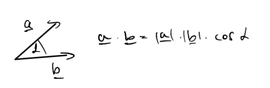

# Többváltozós analízis

# Tartalomjegyzék
1. [Általános tudnivalók](#általános-tudnivalók)
2. [Jelölések](#jelölések)
3. [Definíciók](#definiciók)
4. [Tételek, állítások](#tételek-állítások)
5. [Előadások](#előadások) \
    5.1. [1. Előadás](#1-előadás)
    5.2. [2. Előadás](#2-előadás)
    5.3. [3. Előadás](#3-előadás)
    5.4. [4. Előadás](#4-előadás)
    5.5. [5. Előadás](#5-előadás)
    5.6. [6. Előadás](#6-előadás)
    5.7. [7. Előadás](#7-előadás)

# Általános tudnivalók

# Jelölések
- $\mathbb{R}^p$ - $p$ dimenziós valós tér 
- $A^C$ - $A$ halmaz komplementere 
- $\text{ext } A$ - $A$ halmaz [külső pontjainak](kulso-pont.md) halmaza 
- $\text{int } A$ - $A$ halmaz [belső pontjainak](belso-pont.md) halmaza 
- $\partial A$ - $A$ halmaz [határpontjainak](hatarpont.md) halmaza 
- $\bar{A}$ - $A$ halmaz [lezártja](halmaz-lezartja.md) 
- $\text{graph } f$ - $f$ [grafikonja](grafikon.md) 
- $\gamma_c$ - $f$ függvény $c$-hez tartozó [szintvonala](szintvonal.md) 
- $\Gamma_c$ - $f$ függvény $c$-hez tartozó [kontúrvonala](konturvonal.md) 
- $|\underline{x}|$ - $\underline{x}$ hossza 
- $d(\underline{x}, \underline{y})=|\underline{x}-\underline{y}|$ - $\underline{x}$ és $\underline{y}$ távolsága
- $\text{grad }{f}=\underline{\nabla}f$ - $f$ függvény [gradiens vektora](gradiens-vektor.md)
- $f'_x$ függvény $x$ szerinti [parciális deriváltja](parcialis-derivalt.md)
- $f'$ - függvény [totális deriváltja](totalis-derivalt.md)

# Definíciók
* [Pont környezete](kornyezet.md)
* [Belső pont, belső ponthalmaz](belso-pont.md)
* [Külső pont, külső ponthalmaz](kulso-pont.md)
* [Határpont, határponthalmaz](hatarpont.md)
* [Nyílt halmaz](nyilt-halmaz.md)
* [Zárt halmaz](zart-halmaz.md)
* [Halmaz lezártja](halmaz-lezartja.md)
* [Izolált pont](izolalt-pont.md)
* [Torlódási pont](torlodasi-pont.md)
* [Összefüggőség](osszefuggoseg.md)
* [Tartomány](tartomany.md)
* [Korlátos halmaz](korlatos-halmaz.md)
* [Sorozat határértéke](sorozat-hatarerteke.md)
* [Konvergens sorozat](konvergens-sorozat.md)
* [Függvény határértéke](fuggveny-hatarerteke.md)
* [Függvény folytonossága](fuggveny-folytonossaga.md)
* [Korlátos sorozat](korlatos-sorozat.md)
* [Grafikon](grafikon.md)
* [Kontúrvonal](konturvonal.md)
* [Szintvonal](szintvonal.md)
* [Két út módszer](ket-ut-modszer.md)
* [Parciális derivált](parcialis-derivalt.md)
* [Young tétel](young-tetel.md)
* [Iránymenti derivált](iranymenti-derivalt.md)
* [Érintősík](erintosik.md)
* [Totális derivált](totalis-derivalt.md)
* [Gradiens vektor](gradiens-vektor.md)

# Tételek, állítások
* [+ random allitasok kellenek, amiket felirtunk?]
* [Bolzano-Weierstrass tétel](bolzano-weierstrass.md)

# Előadások
---
## 1. előadás

> ### Félév tematikája
* Többváltozós függvények: $f:\mathbb{R}^p \rightarrow \mathbb{R}$
* Térgörbék: $f:\mathbb{R}\rightarrow \mathbb{R}^p$
* Felületek: $f:\mathbb{R}^2\rightarrow \mathbb{R}^p$
* Vektormezők:  $f:\mathbb{R}^p\rightarrow \mathbb{R}^q$
* Függvénysorozatok/sorok, hatványsorok, Fourier-sorok
* Komplex függvénytani bevezető

> ### $\mathbb{R}^p$ tér topológiája
**Jelölés**: $\underline{x} \in \mathbb{R}^p$

**Def**.: 
* [Pont környezete](kornyezet.md)
* [Belső pontok](belso-pont.md)
* [Külső pontok](kulso-pont.md)
* [Határpontok](hatarpont.md)
* [Nyílt halmaz](nyilt-halmaz.md)
* [Zárt halmaz](zart-halmaz.md)
* [Halmaz lezártja](halmaz-lezartja.md)

**Áll**.: 
* $\text{int } A\subseteq A \subseteq \bar{A}$
* [$\text{ext }A$](kulso-pont.md) mindig [nyílt](nyilt-halmaz.md)
* [$\partial A$](hatarpont.md) mindig [zárt](zart-halmaz.md)
* [$\text{int } A$](belso-pont.md), [$\text{ext } A$](kulso-pont.md), [$\partial A$](hatarpont.md) páronként diszjunkt halmazok
* $\text{int } \ A \cup \text{ ext } A \ \cup \partial A = \mathbb{R}^p$, ha $A \subseteq \mathbb{R}^p$ 

**Példa**: $A=[0;1) \text{ esetén}$
* $\text{int } A = (0; 1)$
* $\text{ext } A = (-\infty; 0) \cup (1; \infty)$
* $\partial A = \{0; 1\}$
* $\bar{A} = [0; 1]$

**Példa**: $A = \{(x, y)\in \mathbb{R}^2: 0<x^2+y^2<1\}$ esetén
* $\text{int } A = A$
* $\text{ext } A = \{ x^2+y^2>1 \}$
* $\partial A = \{ x^2+y^2=1\}\cup \{(0, 0)\}$

**Def**.: 
* [Izolált pont](izolalt-pont.md)
* [Torlódási pont](torlodasi-pont.md)

**Példa**: $A=\{ \frac{1}{n}:n\in \mathbb{N}^p \}$-nak $0$-ban van [torlódási pontja](torlodasi-pont.md)

**Példa**: $A=(0;1]$-nak a [torlódási pontjai](torlodasi-pont.md) $[0;1]$

**Áll**.:
* Véges sok [nyílt halmaz](nyilt-halmaz.md) metszete nyílt
* Akárhány [nyílt halmaz](nyilt-halmaz.md) uniója nyílt
* Véges sok [zárt halmaz](zart-halmaz.md) uniója zárt
* Akárhány [zárt halmaz](zart-halmaz.md) metszete zárt

**Def**.: 
* [Összefüggő halmaz](osszefuggoseg.md)
* [Tartomány](tartomany.md)
* [Korlátos halmaz](korlatos-halmaz.md)

**Példa**: 
* $(1; 3]$ összefüggő
* $A=(0;1) \cup (1;3]$ nem összefüggő, hiszen $B=(0; 1), C=(1; 4)$

**Def**.:
* [Sorozat határértéke](sorozat-hatarerteke.md)
* [Konvergens sorozat](konvergens-sorozat.md)

* [Függvény határértéke](fuggveny-hatarerteke.md)
* [Függvény folytonossága](fuggveny-folytonossaga.md)

**Áll**.: $\lim{\underline{x}_n}=A \Leftrightarrow \forall i<p: (\underline{x}_n)_i\to A_i$

**Példa**:
$\lim_{n\to \infty} \left( \frac{n-1}{n}, \left( 1+\frac{1}{n}\right)^n\right) = (1, e)$

**Áll**.: 
* [Bolzano-Weierstrass tétel](../analizis/bolzano-weierstrass-tetel.md): $\forall$ [korlátos sorozatnak](korlatos-sorozat.md) $\exists$ [konvergens](konvergens-sorozat.md) [részsorozata](../analizis/reszsorozat.md)
* $\mathbb{R}^p$-ben is igaz, hogy $\forall$ [Cauchy sorozat](../analizis/cauchy-sorozat.md) [konvergens](konvergens-sorozat.md)

> ### Kétváltozós függvények

**Def**.:
* [Grafikon](grafikon.md)
* [Kontúrvonal](konturvonal.md)
* [Szintvonal](szintvonal.md)

**Példa**: $f(x, y) = \sqrt{x^2+y^2} = z$, Mi lehet ez?

**Medoldás**:
* Szintvonalak: $\sqrt{x^2+y^2}=c$ - minden szintvonal kör
* Síkmetszés $[x,\ z]$ síkkal, (ekkor $y=0$): $\sqrt{x^2}=|x|=z$
* Tehát minden vízszintes szintvonal kör, és az egyik függőleges egy abszolútérték, így ez egy forgáskúp lesz.

---

## 2. előadás

**Példa**: $\lim_{(x,y)\rightarrow(0,0)}\frac{2xy}{x^2+y^2} = \lim_{(x,y)\rightarrow(0,0)} f(x,y)$

**Def**.:
* [Két út módszer](ket-ut-modszer.md)
* [Parciális derivált](parcialis-derivalt.md)
* [Young tétel](young-tetel.md)
* [Iránymenti derivált](iranymenti-derivalt.md)
* [Totális derivált](totalis-derivalt.md)
* [Érintősík](erintosik.md)
* [Gradiens vektor](gradiens-vektor.md)

**Áll**.:
* $f_{c\underline{v}}' = f_{\underline{v}}'$, ha $c > 0$
* $f'_{-v}(\underline{x}_0)=-f'_{v}(\underline{x}_0)$
* $f$ [totálisan diffható](totalis-derivalt.md) $x_0$ pontban és $f'(\underline{x}_0)=\underline{A} \Leftrightarrow \lim_{\underline{x} \rightarrow \underline{x}_0}{\frac{f(\underline{x})-f(\underline{x}_0) - \underline{A}(\underline{x}-\underline{x}_0)}{|\underline{x}-\underline{x}_0|}} = 0$

**Áll**.:
Tegyük fel, hogy $f$ [totálisan diffható](totalis-derivalt.md) $\underline{x}_0$ pontban $f: \mathbb{R}^p \rightarrow \mathbb{R}$. Ekkor:
1. $f$ [folytonos](fuggveny-folytonossaga.md) $\underline{x}_0$-ban 
2. $f$ [iránymenti deriváltjai](iranymenti-derivalt.md) léteznek az $\underline{x}_0$-ban és $f_{\underline{v}}'(\underline{x}_0) = \underline{f'}(\underline{x}_0) \cdot \frac{\underline{v}}{|\underline{v}|} = \underline{\nabla} f(\underline{x}_0)\frac{\underline{v}}{|\underline{v}|}$
3. $\underline{f'}(\underline{x}_0) = \underline{\nabla} f(x_0)$ [totálisan diffható](totalis-derivalt.md) $f \Rightarrow f$ [parciális deriváltjai](parcialis-derivalt.md) is léteznek.

**Bizonyítások**.:
1. A [totális derivált definíciója](totalis-derivalt.md) szerint a [folytonosság](fuggveny-folytonossaga.md) így teljesül:

$$ \lim_{\underline{x} \rightarrow \underline{x}_0}f(\underline{x})=\lim_{\underline{x} \rightarrow \underline{x}_0}f(\underline{x}_0)+\lim_{\underline{x} \rightarrow \underline{x}_0}\underline{A} \cdot (\underline{x}-\underline{x}_0)+\lim_{\underline{x} \rightarrow \underline{x}_0}\varepsilon(\underline{x}) |\underline{x}-\underline{x}_0| \newline
=f(\underline{x}_0)+\underline{A}\cdot\underline{0}+0=f(\underline{x}_0)$$

2. [Iránymenti derivált](iranymenti-derivalt.md) átírható ha [totálisan diffható](totalis-derivalt.md) a függvényünk: 
$$f'_{\underline{v}}=\lim_{t \rightarrow 0}\frac{f(\underline{x}_0 + t \frac{\underline{v}}{|\underline{v}|})}{t}=\lim_{t \rightarrow 0}\frac{f(\underline{x}_0) + \underline{A}t\frac{\underline{v}}{|\underline{v}|} + \varepsilon(\underline{x})t\frac{\underline{v}}{|\underline{v}|} - f(\underline{x}_0)}{t} \newline =
\lim_{t \rightarrow 0}\underline{A}\frac{\underline{v}}{|\underline{v}|} + \varepsilon(\underline{x})\frac{\underline{v}}{|\underline{v}|}$$
A [totálisan deriválhatóság](totalis-derivalt.md) miatt $\varepsilon(\underline{x})=\varepsilon(\underline{x}_0+t\frac{\underline{v}}{|\underline{v}|})$, ami $0$-ba tart.
$$f'_{\underline{v}}(\underline{x}_0)=\underline{A}\frac{\underline{v}}{|\underline{v}|} = f'(\underline{x}_0) \cdot \frac{\underline{v}}{|\underline{v}|}$$

3. A 2. pontból, illetve a [totális derivált](totalis-derivalt.md), [iránymenti derivált](iranymenti-derivalt.md), és [parciális derivált](parcialis-derivalt.md) definícióiból következik:
Tekintsük az $1$-es dimenzió irányvektorát:
$$
    \underline{v} = \begin{bmatrix}
           1 \\
           0 \\
           \vdots \\
           0
         \end{bmatrix},\ f'_{\underline{v}}=\underline{A}\cdot\underline{v}=A_1=f'_{x_1}
$$ 
Tehát a [parciális derivált](parcialis-derivalt.md) egy speciális [iránymenti derivált](iranymenti-derivalt.md).
Hasonlóan megismételhetjük minden $x_1,\ x_2,\ \dots,\ x_p$-vel. Így megkapjuk $\underline{A}$ minden koordinátáját:

$$\underline{A}=(f'_{x_1},f'_{x_2},\dots, f'_{x_p})=\underline{f'}=\underline{\nabla} f$$

---

## 3. előadás

**Def**.:
* [Totális differenciálhatóság](totalis-diffhatosag.md)

**Megj**.:
[Érintő hipersík](erintosik.md) egyenlete: $z = f(\underline{x}_0) + f'(\underline{x}_0)(\underline{x}-\underline{x}_0)$, ez a hipersík átmegy az $(\underline{x}_0, f(\underline{x}_0)) \in \mathbb{R}^{p+1}$ ponton $\mathbb{R}^{p+1}$-ben

**Def**.:
* [Folytonos differenciálhatóság](folytonos-diffhatosag.md)

**Áll**.: Ha $f$ [differenciálható](totalis-diffhatosag.md) $\underline{x}_0$ akkor:
* $f$ [folytonos](fuggveny-folytonossaga.md) $\underline{x}_0$-ban
* $f$ [parciális deriváltjai](parcialis-derivalt.md) $\exists$-nek, és $\underline{f}'(\underline{x}_0)=^{\text{áll}} \underline{\nabla}f(\underline{x}_0)=^{\text{def}} \left( f'_{x_1}(\underline{x}_0), f'_{x_2}(\underline{x}_0), \dots ,f'_{x_p}(\underline{x}_0) \right)^T$ 
* $f$ [iránymenti deriváltjai](iranymenti-derivalt.md) $\exists$-nek, és: $f'_{\underline{v}}(\underline{x}_0)=\underline{\nabla}f(\underline{x}_0)\cdot \frac{\underline{v}}{|\underline{v}|}$, ahol $\underline{v}\in \mathbb{R}^p\setminus \{0\}$

**Áll**.: Ha $f$ [folytonosan differenciálható](folytonos-diffhatosag.md), akkor [totálisan differenciálható](totalis-diffhatosag.md).

**Biz**.: 
Tfh. $f$ [folytonosan diffható](folytonos-diffhatosag.md) $(x_0, y_0)$ pontban, ekkor definícióból tudjuk, hogy a [parciális deriváltak](parcialis-derivalt.md) ($f'_x$, $f'_y$) léteznek ott.

Kell: $f$ [totálisan diffható](totalis-diffhatosag.md) $(x_0, y_0)$-ban, azaz kell: $$\lim_{(x, y) \rightarrow (x_0, y_0)}\textcolor{red}{\alpha}:=\lim_{(x, y) \rightarrow (x_0, y_0)}{\frac{f(x, y)-f(x_0, y_0) - f'_x(x_0, y_0)(x-x_0)-f'_y(x_0, y_0)(y-y_0)}{\sqrt{(x-x_0)^2+(y-y_0)^2}}}\stackrel{?}{=}0$$ 
Most hozzáadtunk és kivonunk $f(x_0, y)$-t.
$$\lim_{(x, y) \rightarrow (x_0, y_0)}{\frac{f(x, y) \boxed{\textcolor{purple}{-f(x_0, y)}} - f'_x(x_0, y_0)(x-x_0) \boxed{\textcolor{purple}{+f(x_0, y)}}-f(x_0, y_0)-f'_y(x_0, y_0)(y-y_0)}{\sqrt{(x-x_0)^2+(y-y_0)^2}}}=0 \newline$$
A [Lagrange-tétel](../analizis/lagrange-tetel.md)-ből következik, hogy $\exists \tilde{x}$ az $x,\ x_0$ között:
$$f(x, y)-f(x_0, y)=g(x)-f(x_0)=g(\tilde{x})(x-x_0)=f'_x(\tilde{x}, y)(x-x_0)$$
Hasonlóan működik az $f'_y$-al is.
Visszahelyettesítve:
$$\lim_{(x, y) \rightarrow (x_0, y_0)}{\frac{\boxed{\textcolor{green}{f'_x(\tilde{x}, y)(x-x_0)}} - f'_x(x_0, y_0)(x-x_0) \boxed{\textcolor{green}{f'_y(x_0, \tilde{y})(y-y_0)}}-f'_y(x_0, y_0)(y-y_0)}{\sqrt{(x-x_0)^2+(y-y_0)^2}}}=0$$
Szétbontva:
$$\lim_{(x, y) \rightarrow (x_0, y_0)} \left[ f'_x(\tilde{x}, y)-f'_x(x_0, y_0) \right]\frac{x-x_0}{\sqrt{(x-x_0)^2+(y-y_0)^2}}+\left[f'_y(x_0, \tilde{y})-f'_y(x_0, y_0) \right]\frac{y-y_0}{\sqrt{(x-x_0)^2+(y-y_0)^2}}$$
[Háromszög egyenlőtlenség](../analizis/haromszog-egyenlotlenseg.md) miatt:
$$\lim_{(x, y) \rightarrow (x_0, y_0)} \left|\frac{x-x_0}{\sqrt{(x-x_0)^2+(y-y_0)^2}}\right|<1,\ \lim_{(x, y) \rightarrow (x_0, y_0)} \left|\frac{y-y_0}{\sqrt{(x-x_0)^2+(y-y_0)^2}}\right|<1, $$
Illetve:
$$ \lim_{(x, y) \rightarrow (x_0, y_0)}f'_x(\tilde{x}, y)-f'_x(x_0, y_0)=f'_x(x_0, y_0)-f'_x(x_0, y_0)=0 \newline
\lim_{(x, y) \rightarrow (x_0, y_0)}f'_y(x_0, \tilde{y})-f'_y(x_0, y_0)=f'_y(x_0, y_0)-f'_y(x_0, y_0)=0 $$
Tehát:
$$ \lim_{(x, y) \rightarrow (x_0, y_0)} |\textcolor{red}{\alpha}|\leq 0\cdot 1+0\cdot1=0 \newline \textcolor{red}{\alpha}\to 0$$
Tehát ekkor $f$ [totálisan diffható](totalis-diffhatosag.md)

**Áll**.: Ha $f$ kétszer [folytonosan diffható](folytonos-diffhatosag.md) akkor $f''_{xy}=f''_{yx}$, ez a [Young tétel](young-tetel.md).

---

## 4. Előadás

**Áll**.: Tegyük fel, hogy $g:\mathbb{R}^3 \rightarrow \mathbb{R}$ [totálisan diffható](totalis-diffhatosag.md) az $\underline{x}_0$ pontban. Ekkor a $g(\underline{x})=g(\underline{x}_0)$ szintfelület $\underline{x}_0$ pontbeli [érintősíkja](./erintosik.md):
$$(\underline{\nabla}g)(\underline{x}_0) \cdot (\underline{x}-\underline{x}_0) = 0$$

**Biz**.: Mivel $g$ [totálisan diffható](./totalis-diffhatosag.md) az $\underline{x}_0$ pontban, ezért $(\underline{\nabla}g)(\underline{x}_0)$ merőleges az $\underline{x}_0$ ponton átmenő szintfelületre, így $\underline{n} = \underline{\nabla}g(\underline{x}_0)$ az [érintősíknak](./erintosik.md) normálvektora.

> ### [Gradiensvektor](./gradiens-vektor.md) tulajdonságai

**Áll**.: Tfh. $\mathbb{R}^p \rightarrow \mathbb{R}$ totálisan diffható $\underline{x}_0 \in \mathbb{R}^p$ pontban. Ekkor:
1. $\underline{\nabla}f(\underline{x}_0)$ a legnagyobb növekedés iránya $\underline{x}_0$ pontban
2. $-\underline{\nabla}f(\underline{x}_0)$ a legnagyobb csökkenés iránya $\underline{x}_0$ pontban
3. $|f'_{\underline{\nabla}f(\underline{x}_0)}(\underline{x}_0)| = |\underline{\nabla}f(\underline{x}_0)|$, $|f'_{-\underline{\nabla}f(\underline{x}_0)}(\underline{x}_0)| = |\underline{\nabla}f(\underline{x}_0)|$
4. $\underline{\nabla}f(\underline{x}_0) \perp f=f(\underline{x}_0)$ szintvonalra
5. $\max_{\underline{v}} f'_{\underline{v}}(\underline{x}_0)=|\underline{\nabla}f(\underline{x}_0)|$
6. $\min_{\underline{v}} f'_{\underline{v}}(\underline{x}_0)=-|\underline{\nabla}f(\underline{x}_0)|$

**Biz**.: $\underline{v} \in \mathbb{R}^p$
$\underline{f'}_{\underline{v}}(\underline{x}_0) = \underline{\nabla}f(\underline{x}_0) \cdot \frac{\underline{v}}{|\underline{v}|} = |\underline{\nabla}f(\underline{x}_0)| \cdot |\frac{\underline{v}}{|\underline{v}|}| \cdot \cos \alpha$

Látható, hogy akkor lesz maximális $\underline{f'}_{\underline{v}}(\underline{x}_0)$ , ha $cos \alpha = 1$, tehát $\alpha = 0°$. Ezzel ekvivalens, hogy $\underline{\nabla}f || \underline{v}$ és $\underline{\nabla}f || c \cdot \underline{v} \ \ (c > 0)$. Ilyenkor $|f'_{\underline{v}}(\underline{x}_0)|=|\underline{\nabla}f(\underline{x}_0)|$. (5. állítás)
Minimum esetén hasonlóan eljárva, csak $\alpha = -1$ és $c < 0$ azt kapjuk, hogy $|f'_{\underline{v}}(\underline{x}_0)|= -|\underline{\nabla}f(\underline{x}_0)|$. (6. állítás)

**Áll**.: Ha $\underline{\nabla} f (\underline{x}_0) \neq \underline{0}$ és $f$ [totálisan diffható](totalis-diffhatosag.md) $\underline{x}_0$-ban, akkor $f=c$, $c=f(\underline{x}_0)$ [szintvonal](./szintvonal.md) $\underline{x}_0$ egy kis [környezetében](./kornyezet.md) paraméterezhető $x(t)$, $y(t)$ [diffható](./totalis-diffhatosag.md) függvényekkel.

**Áll**.: Tfh. $f: \mathbb{R}^2 \rightarrow \mathbb{R}$, $x, y: \mathbb{R} \rightarrow \mathbb{R}$ diffhatóak. $t \in \mathbb{R}$
Ekkor $\frac{d}{dt} f(x(t), y(t)): \mathbb{R} \rightarrow \mathbb{R} = \boxed{\textcolor{green}{\underline{f}'(x(t), y(t))}} \cdot (x'(t), y'(t))$
$\textcolor{green}{\underline{f}'(x(t), y(t))} = \left( f'_x(x(t), y(t)), f'_y(x(t), y(t)) \right) = \textcolor{orange}{f'_x|_{(x(t), y(t)) = p(t)} \cdot x'(t) + f'_y|_{(x(t), y(t)) = p(t)} \cdot y'(t)}$

$c = f(x(t), y(t)) \ / \frac{d}{dt}$
$0 = \textcolor{orange}{f'_x|_{p(t)} \cdot x'(t) + f'_y|_{p(t)} \cdot y'(t)} = \underline{\nabla}f(\underline{x}_0) \cdot(x'(t_0), y'(t_0))$ azért teljesül, mert $\underline{\nabla} f(\underline{x}_0)$ merőleges $(x'(t_0), y'(t_0))$ érintővektorra.

**Áll**.: Tfh.: $g:\mathbb{R}^3 \rightarrow \mathbb{R}$ [totálisan diffható](./totalis-diffhatosag.md) $\underline{x}_0 \in \mathbb{R}^3$ pontban, és $\underline{\nabla}g(\underline{x}_0) \neq \underline{0}$.
Ekkor a $g=c, c=g(\underline{x}_0)$ szintfelületnek (hasonló a szintvonalhoz [szintvonal](./szintvonal.md)) az $\underline{x}_0$ pontban van érintősíkja, és ez $\underline{\nabla}g(\underline{x}_0) \cdot (\underline{x} - \underline{x}_0) = 0$

**Biz**.:
A [gradiens vektor](./gradiens-vektor.md) egyik tulajdonsága, hogy a $\underline{0} \neq \underline{\nabla}g(\underline{x}_0)$ merőleges a $g=c$ szintfelületre, így a szintfelület [érintősíkjának](./erintosik.md) normálvektora pontosan $\underline{\nabla}g(\underline{x}_0)$. Tehát a sík egyenlete: $\underline{n} \cdot (\underline{x} - \underline{x}_0) = \underline{\nabla}g(\underline{x}_0) \cdot (\underline{x} - \underline{x}_0) =  0$.

## 5. Előadás
Elmaradt

## 6. Előadás
> ### Diff. egyenletek
[Diffegyenlet definíciók](./differencial-egyenlet.md)

**Példa**.:
Tfh $f(x, y)=-\frac{P(x,y)}{Q(x,y)}$. Tfh. $D\subseteq\mathbb{R}^2$ [tartományon](tartomany.md) $Q\neq0$. Ekkor:
$$y'=-\frac{P(x,y)}{Q(x,y)} \newline
Qy'=-P \newline
P+qy'=0 \newline
P+Q\frac{dy}{dx}=0
$$
Azaz formálisan átírva:
$$Pdx+Qdy=0 $$

##

**Def**.: [egyszeresen összefüggő tartomány](./egyszeresen-osszefuggo-tartomany.md)

**Példa**.: Adjuk meg a $(2xy)dx + (2y + x^2)dy = 0$ [differenciálegyenlet](./differencial-egyenlet.md) általános megoldását és az $y(1) = 2$ kezdeti feltételt teljesítő megoldást.

**Megoldás**.: 
A $P(x, y)dx + Q(x, y)dy = 0$ formában $P(x, y) = 2xy$, $Q(x, y) = (2y + x^2)$

Ellenőrizzük, hogy a [diffegyenlet](./differencial-egyenlet.md) [egzakt](./differencial-egyenlet.md#egzakt-diffegyenletek)-e. Ennek két feltétele van:
1. $P, Q$ [folytonosan diffhatóak](./folytonos-diffhatosag.md) az egész $R^2$-en: 
Ez a feltétel **teljesül**.
2. $P'_y \stackrel{?}{=} Q'_x$
$P'_y = 2x = Q'_x$, tehát ez a feltétel is **teljesül**.

Ez azt jelenti, hogy [egzakt diffegyenlettel](./differencial-egyenlet.md#egzakt-diffegyenletek) van dolgunk.

Kell egy olyan $F$, aminek az $x$ szerinti [parciális deriváltja](./parcialis-derivalt.md) $P$-vel, az $y$ szerinti $Q$-val egyenlő.
$F'_x = P = 2xy \Rightarrow F(x, y) = \int{2xydx} = x^2y + A(y)$
$$
\begin{alignat*}{3}
F'_y = Q = 2y + x^2 &= F'y = x^2 + A'y \\
x^2 + A'(y) &= 2y + x^2 \\
A(y) &= y^2 + \widetilde{c} \quad (\widetilde{c} \in \mathbb{R})
\end{alignat*}
$$

Tehát $F(x, y) = x^2y + y^2 + \widetilde{c} = \widetilde{\widetilde{c}}$
- A [diffegyenlet](./differencial-egyenlet.md) általános megoldása: 
$x^2y + y^2 = c$, $c \in \mathbb{R}$ ($c = \widetilde{\widetilde{c}} - \widetilde{c}$)
- $y(1) = 2$ kezdeti feltételt teljesítő megoldás:
$x=1, y=2$ rajta van a megfelelő [szintvonalon](./szintvonal.md) $\Rightarrow$ $1^2 \cdot 2 + 2^2 = 6 = c$
A megoldás: $x^2y + y^2 = 6$

[Mi van, ha a diffegyenlet nem egzakt?](./differencial-egyenlet.md#majdnem-egzakt-diffegyenlet-megoldása)

**Def**.:
- [első differenciál](./elso-differencial.md)
- [teljes differenciál](./teljes-differencial.md)

**Áll**.:
Tfh. $P, Q: \mathbb{R}^2 \rightarrow \mathbb{R}$ [folytonosan diffható](./folytonos-diffhatosag.md) egy $D \subseteq \mathbb{R}^2$ [egyszeresen összefüggő tartományban](./egyszeresen-osszefuggo-tartomany.md), azaz $f'_x = P$ és $f'_y = Q$ Ekkor $Pdx+Qdy$ [teljes differenciál](./teljes-differencial.md) $\Leftrightarrow$ $P'_y = Q'_x$.

## 7. Előadás

> ### $\mathbb{R}^n \rightarrow \mathbb{R}^m$ függvények differenciálása

**Def**.:
- [lineáris leképezés](./linearis-lekepezes.md)
- [többdimenziós diffhatóság](./tobbdimenzios-diffhatosag.md)

**Emlékeztető**:
$f: \mathbb{R}^n \rightarrow \mathbb{R}$, ha $f$ [diffható](./totalis-diffhatosag.md), akkor $\underline{f}' = \underline{\nabla}f(\underline{a})=(f'_{x_1}, f'_{x_2}, \cdots, f'_{x_n})(\underline{a})$, azaz a derivált megegyezeik a [gradiensével](./gradiens-vektor.md).

**Áll**.:
$\underline{f}: \mathbb{R}^n \rightarrow \mathbb{R}^m$
$$\underline{f} = \begin{pmatrix}f_1 \\ \vdots \\ f_m \\ \end{pmatrix}$$
$f$ [diffható](./tobbdimenzios-diffhatosag.md) $\underline{a}$-ban $\Leftrightarrow$ $f_1, \cdots, f_m: \mathbb{R}^n \rightarrow \mathbb{R}$ [diffható](./totalis-diffhatosag.md)(másik definícióra visz ez a link) $\underline{a}$-ban és 

$$
\begin{alignat*}{3}
\underline{f}'|_{\underline{a}} &= \left. \begin{pmatrix}f'_1 \\ \vdots \\ f'_m \end{pmatrix}\right|_{\underline{a}} \\
&= \left. \begin{pmatrix}\underline{\nabla}f_1 \\ \vdots \\ \underline{\nabla}f_m \end{pmatrix}\right|_{\underline{a}} \\
&= \left. \begin{pmatrix}\underline{\nabla}f_1 \\ \vdots \\ \underline{\nabla}f_m \end{pmatrix} \right|_{\underline{a}} \\
&= \left. \begin{pmatrix}
\frac{\partial f_1}{\partial x_1} & \cdots & \frac{\partial f_1}{\partial x_n} \\
\vdots & \ddots & \vdots \\
\frac{\partial f_m}{\partial x_1} & \cdots & \frac{\partial f_m}{\partial x_n} \\
\end{pmatrix} \right|_{\underline{a}}
\end{alignat*}
$$

**Áll**.: (Összetett függvény deriválási szabálya)
Tfh. $g: \mathbb{R}^n \rightarrow \mathbb{R}^m$ $f: \mathbb{R}^m \rightarrow \mathbb{R}^e$. $g$ [diffható](./tobbdimenzios-diffhatosag.md) $\underline{a} \in \mathbb{R}^n$ pontban, $f$ [diffható](./tobbdimenzios-diffhatosag.md) $g(\underline{a}) \in \mathbb{R}^m$ pontban.
Ekkor $f \circ g: \mathbb{R}^n \rightarrow \mathbb{R}^e$ is [diffható](./tobbdimenzios-diffhatosag.md) $\underline{a} \in \mathbb{R}^n$-ben és
$$(f \circ g)'(\underline{a}) = \underline{\underline{f'}}(\underline{g}(\underline{a})) \circ \underline{\underline{g'}}(\underline{a})$$

**Alkalmazás**.: Láncszabály különböző alakjai
1. $f: \mathbb{R}^2 \rightarrow \mathbb{R}$ [diffható](./totalis-diffhatosag.md), $g: \mathbb{R} \rightarrow \mathbb{R}^2$ [diffható](./totalis-derivalt.md), tehát $f \circ g$ is [diffható](./tobbdimenzios-diffhatosag.md) és 
$$
\begin{alignat*}{3}
(f \circ g)'(t) &= \underline{f}'(\underline{g}(t)) \cdot \underline{g}'(t) \\
&= \left. (f'_x, f'_y) \right|_{(x(t), y(t))} \\
&= f'_x(x(t), y(t)) \cdot x'(t) + f'_y(x(t), y(t)) \cdot y'(t)
\end{alignat*}
$$
