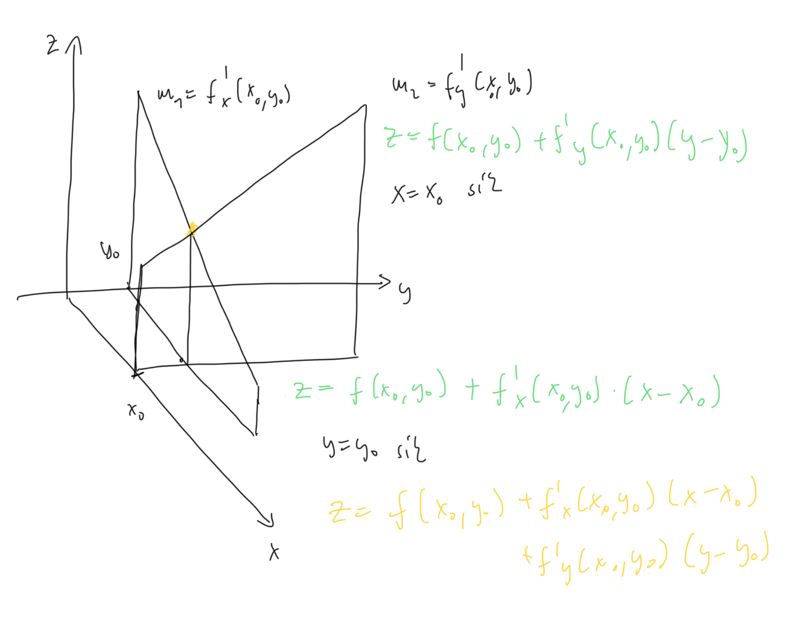

# Érintősík egyenlete

## [Parciális deriváltakkal](parcialis-derivalt.md)
$\exists$ ha a függvény vizsgált pontjában [totálisan deriválható](totalis-derivalt.md). A két [parciális derivált](parcialis-derivalt.md) által meghatározott érintőegyenesek 
$$z = f(x_0, y_0) + f'_x{(x_0, y_0)}(x-x_0) + f'_y{(x_0, y_0)}(y-y_0)$$

## [Totális derivált](totalis-derivalt.md)-al: Érintő hipersík

Egyenlete: 
$$z = f(\underline{x}_0) + \underline{f}'(\underline{x}_0)(\underline{x}-\underline{x}_0)$$
Ez a hipersík átmegy az $(\underline{x}_0, f(\underline{x}_0)) \in \mathbb{R}^{p+1}$ ponton $\mathbb{R}^{p+1}$-ben