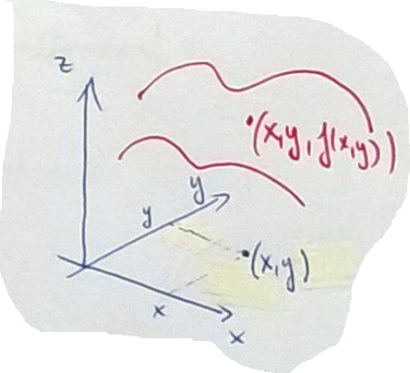

# Grafikon

## Definíció
$f: \mathbb{R}^2 \rightarrow \mathbb{R}$ függvény **grafikonja**:

$$ \text{graph } f = \{ \left(x, y, f(x, y)\right): (x, y)\in D_f \} $$

Azon pontok halmaza, ahol az $(x, y)$ koordináta a bemenő értékek, a $z$ koordináta pedig $f(x, y)$ lesz.

