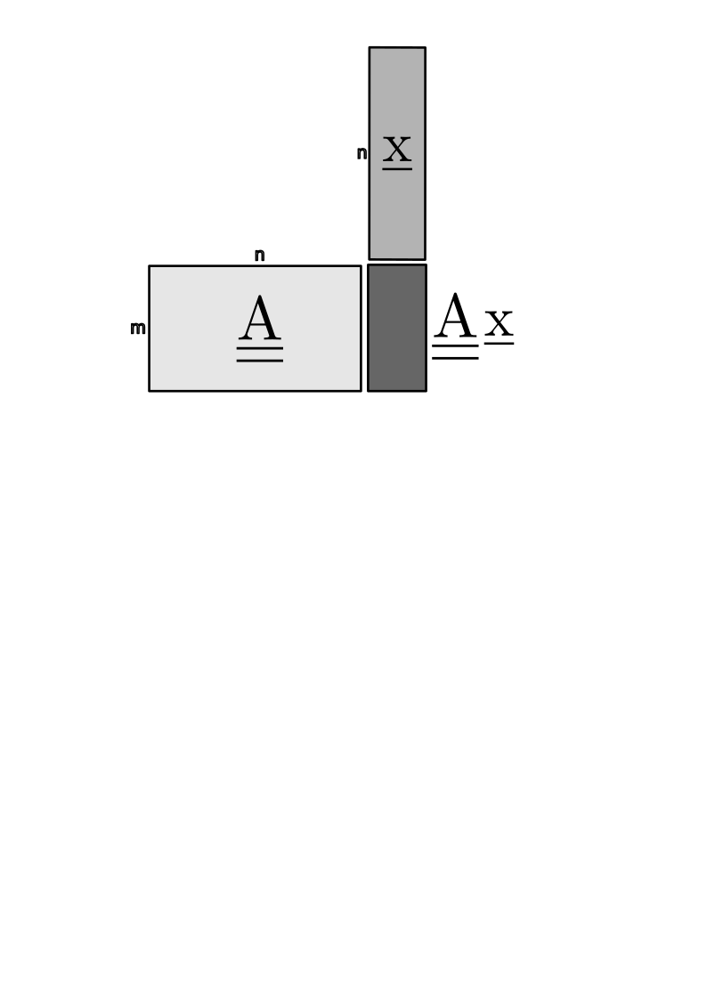

# Lineáris leképezés

**Def**.:
$A: \mathbb{R}^n \rightarrow \mathbb{R}^m$ **lineáris leképezés**, ha:
- $A(\lambda \underline{x}) = \lambda A(\underline{x})$, $\lambda \in \mathbb{R}$
- $A(\underline{x} + \underline{y}) = A(\underline{x}) + A(\underline{y})$, $\forall \underline{x}, \underline{y} \in \mathbb{R}^n$

$A$ mátrix standard bázisban: $\underline{\underline{A}}$ $m \times n$-es mátrix

