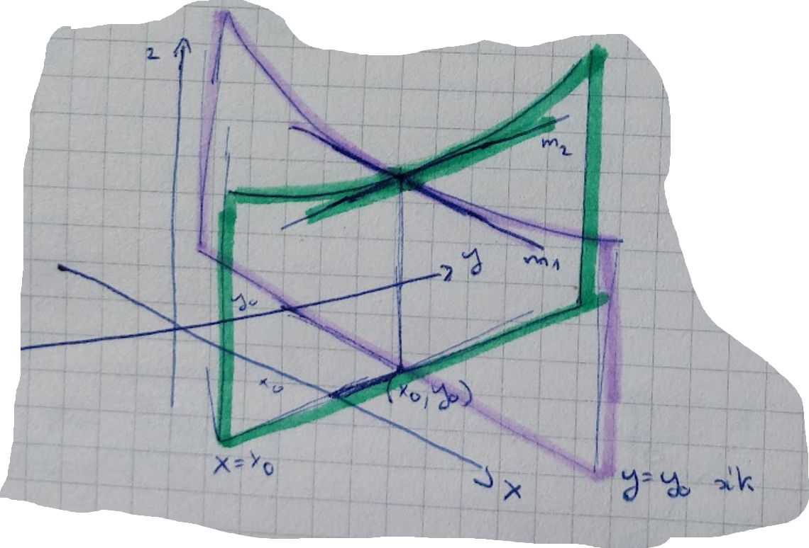

# Parciális derivált

## Definíció 1
$f(x, y): \mathbb{R}^2 \rightarrow \mathbb{R}$

$y = y_0$ mentén vizsgáljuk, akkor egyváltozós függvényt kapunk.
$a(x) = f(x, y_0)$, ahol $y_0$ fix. Ekkor $f$ $x$ szerinti parciális deriváltja:
$$f'_x(x_0, y_0)=\frac{\partial f}{\partial x}(x_0, y_0) := a'(x_0)$$

## Definíció 2
$$\lim_{x \rightarrow x_0}{\frac{f(x, y_0)-f(x_0, y_0)}{x-x_0}} := f'_x(x_0, y_0) = \frac{\partial f}{\partial x}(x_0, y_0)$$

Ha létezik és véges, akkor ez $f$ $x$ szerinti parciális deriváltja.

