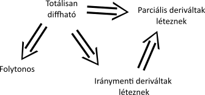

# Tájékoztató

A 2023/24-es tanév vizsgájára szükséges anyagok. Figyelem, a kidolgozásban komplex függvénytan nem szerepel, mivel nem jutott idő arra.

# Tételek

## Tartalomjegyzék

1. [Kétváltozós függvények szemléltetése, határérték, folytonosság](#1-kétváltozós-függvények-szemléltetése-határérték-folytonosság)
    - Nyílt, zárt halmaz, halmaz belső-, külső-, határpontja, torlódási pontja, halmaz belseje, külseje, határa, lezártja $\mathbb{R}^n$-ben
    - Két és többváltozós függvény határértéke, folytonossága, két út vizsgálat.
    - Nevezetes felületek: sík, forgáskúp, forgásparaboloid, elliptikus paraboloid, hiperboloid, gömb, ellipszoid felismerése egyenlete alapján.
2. [Parciális, iránymenti és totális differenciálhatóság, érintősík, gradiens](#2-parciális-iránymenti-és-totális-differenciálhatóság-érintősík-gradiens)
    - Parciális, iránymenti és totális derivált, érintősík, gradiens definíciója. Folytonosság, parciális, iránymenti és totális differenciálhatóság kapcsolata. Melyikből következik melyik (indoklás vagy ellenpélda). Érintősík létezésének szükséges és elégséges feltétele. Iránymenti derivált kiszámítása (milyen feltételek mellett). Gradiens szemléletes jelentése, tulajdonságai, mire használható (milyen feltételek mellett).
3. [Young-tétel, teljes differenciálok, egzakt differenciálegyenletek.](#3-young-tétel-teljes-differenciálok-egzakt-differenciálegyenletek)
    - Young-tétel
    - Teljes differenciál, egzakt differenciálegyenlet fogalma. ezek ellenőrzéséről szóló tételek.
    - Egzakt differenciálegyenletek megoldásának menete. Példák. Egy változótól függő integráló tényező keresése, mikor létezik.
4. $\mathbb{R}^n$-ből $\mathbb{R}^m$-be képező függvény differenciálhatósága, láncszabály. Lagrange-féle középértéktétel, differenciálok,  hibaszámítás, Taylor-polinom.
    - $\mathbb{R}^n$-ből $\mathbb{R}^m$-be képező függvény totális deriválhatóságának fogalma, a derivált értelmezése, a derivált(tenzor) mátrixa standard bázisban. Láncszabály (általában és speciális esetei, példák)
    - Implicit deriválás (formálisan)
    - Lagrange-féle középértéktétel (bizonyítása is), egy és többváltozós függvény differenciáljai
    - Taylor-polinom, közelítés, Lagrange-maradéktag.
5. Lokális szélsőérték, kvadratikus alakok, Hesse-mátrix, stacionárius pontok osztályozása.
    - Lokális szélsőérték, stacionárius pont fogalma
    - Lokális szélsőérték létezésének szükséges feltétele (milyen feltételek mellett)
    - Kvadratikus alak és a hozzá tartozó szimmetrikus mátrix
    - Pozitív, negatív definit, indefinit, pozitiv, negatív szemidefinit kvadratikus alak/szimmetrikus mátrix fogalma
    - Hogyan dönthető el egy kvadratikus alakról/szimmetrikus mátrixról, hogy milyen definit.
    - Hesse-mátrix fogalma
    - Lokális szélsőértékhely létezésének elégséges feltétele két és több dimenzióban
    - Stacionárius pontok típusának vizsgálata.
6. Implicitfüggvény-tétel, inverzfüggvény-tétel.
    - Implicit- és inverzfüggvénytétel két és többdimenzióban, implicit és inverzfüggvény deriváltja, példák. (Hol használtuk az implicit ill. az inverzfüggvénytételt?)
7. Feltételes és globális szélsőérték-problémák. Lagrange multiplikátor módszer.
    - Abszolút szélsőérték fogalma. Mikor létezik biztosan? Hogyan kereshető?
    - Feltételes szélsőérték fogalma. Hogyan kereshető? Lagrange multiplikátor módszer. Lagrange-tétel különböző formái (ezek szemléletes bizonyítása).
8. Kettős integrál, Fubini-tétel, integrálás normáltartományon.
    - Jordan mérhető halmaz fogalma $\mathbb{R}^2$-ben, kettős integrál definíciója, Riemann-integrálhatóság elégséges feltétele, Fubini-tétel téglalapon és normáltartományokon.
9. Helyettesítés kettős integrálban, mérték- és integráltranszformáció, Jacobi-determináns, lineáris helyettesítések, síkbeli polárkoordináták.
    - Helyettesítés kettős integrálban, mérték- és integráltranszformációs tétel, példák, Jacobi determináns fogalma, inverz Jacobi-determináns.
    - Lineáris helyettesítés és síkbeli polárkoordináták alkalmazása, példák, Gauss-integrál.
    - Terület, tömeg, súlypont és tehetetlenségi nyomaték számítása.
10. Hármas integrál, helyettesítés hármas integrálban, hengerkoordináták, gömbi koordináták.
    - Hármas integrál, integrálás normáltartományon, példák.
    - Térfogat, tömeg, súlypont és tehetetlenségi nyomaték számítása.
    - Steiner-tétel.
    - Helyettesítés hármas integrálban.
    - Hengerkoordináták, gömbi koordináták definíciója, használata, Jacobi-determináns.
    - Forgáskúp, forgásparaboloid, gömbcikk belsejének paraméterezése.
11. Térgörbék (rektifikálhatóság, ívhossz, ívhossz szerinti paraméterezés, görbület, torzió, kísérő triéder,
 Frenet-formulák).
    - Reguláris térgörbe, görbe érintője, rektifikálhatósága, ívhossza, ívhossz kiszámítása, előjeles ívhossz, természetes
(ívhossz szerinti) paraméterezés.
    - Görbület és torzió definíciója, szemléletes jelentése, számítási módja.
    - Görbület illetve torzió mikor 0.
    - Kísérő triéder (érintő, normális és binormális egységvektor definíciója és számítási módja, szemléletes jelentése).
    - Simuló, normális és rektifikáló sík, simulókör. Frenet-formulák (levezetés). Görbeelmélet alaptétele.
    - Gyorsulás érintő és normális irányú komponense.
12. Felületek (irányíthatóság, érintősík, felszín), vektormező felületi integrálja.
    - Paraméteres alakban megadott felületek érintősíkja, felszíne, normálvektora.
    - Reguláris paraméterezés.
    - Felszín kiszámítása paraméteres alakban megadott felület esetén. (Miért így számolható.)
    - Függvény grafikon paraméterezése, felszíne.
    - Forgásfelületek felszíne.
    - Felület irányíthatósága. Példák.
    - Vektormező felületi integrálja/fluxus, fizikai értelmezés, kiszámítási módjai. (Előadáson később szerepelt.)
    - (Skalármező felületi integrálja, lásd 3. házi feladat.)
13. Skalármezők és vektormezők differenciálása (gradiens, deriválttenzor, deriválttenzor invariánsai,
divergencia, rotáció, koordinátafüggetlen értelmezés, Laplace operátor), szorzatok divergenciája és rotációja
    - Skalármezők és vektormezők, ezek differenciálása (gradiens, deriválttenzor).
    - Centrális skalármező, ennek gradiense.
    - Centrális vektormező, ennek divergenciája és rotációja (lásd gyakorlatot is).
    - Örvény divergenciája és rotációja.
    - Deriválttenzor invariánsai: divergencia és rotáció definíciója, koordinátarendszer független értelmezése.
    - Laplace operátor
    - Nevezetes azonosságok: szorzatok gradiense, divergenciája és rotációja. div grad u, rot grad u, div rot v=? Miért? (Egyszerű levezetések.)
14. Vonalintegrál, potenciálos, konzervatív és örvénymentes vektormezők, Newton-Leibniz formula.
    - Skalár és vektormező görbementi integráljának definíciója, kiszámítása
    - Potenciális, konzervatív és örvénymentes vektormező definíciója, ezek egymáshoz való viszonya, ezekről szóló állítások (bizonyítás vagy ellenpélda)
    - Potenciálfüggvény létezésének szükséges ill elégséges feltétele
    - Newton-Leibniz formula.
15. Green-tétel, Stokes-tétel.
    - (Jordan-görbetétel).
    - Green-tétel. (Bizonyítás főbb lépései.)
    - Green-tétel alkalmazásai.
    - Stokes-tétel. Alkalmazása. Kapcsolata a Green-tétellel.
    - Rotáció szemléletes jelentése. (Vektormező felületi integrálja ebben a részben szerepelt.)
16. Gauss-Osztrogradszkij tétel.
    - Gauss-Osztrogradszkij tétel. (Bizonyítás téglatesten.)
    - (Green-tétel, mint Gauss-tétel speciális esete.)
    - Divergencia szemléletes jelentése.
17. Többes integrál és vektoranalízis alkalmazásai a geometriában és a fizikában.
    - Terület, térfogat, tömeg, tehetetlenségi nyomaték, súlypont számítása, munka, fluxus
    - Kontinuitási és hővezetési egyenlet
18. Függvénysorozatok, függvénysorok pontonkénti és egyenletes konvergenciája, folytonosság, deriválás,
integrálás, Weierstrass-tétel.
    - Függvénysorozatok és függvénysorok pontonkénti és egyenletes konvergenciája. Folytonos függvények pontonkénti és egyenletes limesze.
    - Integrál és limesz felcserélhetősége.
    - Deriválás és limesz kapcsolata. Példák.
    - Weierstrass-tétel
függvénysorok egyenletes konvergenciájáról. Példák.
19. Hatványsorok, konverganciasugár, konvergenciatartomány, egyenletes konvergencia és
következményei, Taylor-sor, analitikus függvények, nevezetes Taylor-sorok (exponenciális, trigonometrikus, mértani, binomiális, logaritmus, inverz trigonometrikus).
    - Valós (és komplex) hatványsorok, konvergenciatartomány, abszolút konvergencia tartomány alakja, meghatározása.
    - A hatványsor egyenletesen konvergens és tagonként integrálható a konvergenciatartomány minden korlátos zárt részintervallumán, a konvergenciatartomány belsejében tagonként deriválható. Alkalmazás, példák.
    - Taylor-sor, analitikus függvény fogalma.
    - Nevezetes Taylor-sorok (exponenciális, sh, ch, trigonometrikus (sin, cos), mértani, binomiális, logaritmus, inverz trigonometrikus (arcsin, arctg).
20. Trigonometrikus és Fourier-sorok. Fourier-sorok pontonkénti és egyenletes konvergenciájára vonatkozó tételek, Fejér-tétel, $L^2$ konvergencia, Parseval-egyenlőség.
    - Trigonometrikus sor, együtthatók hogyan számolhatóak, mikor. $L^2[a,b]$ tér, ezen értelmezett skalárszorzat, norma.
    - (Teljes) ortonormált rendszer az $L^2[-π,π]$ térben.
    - 2π periodikus függvény Fourier-sora, 2L periodikus függvény Fourier-sora.
    - Fourier-együtthatók számítása.
    - Trigonometrikus polinomok Fourier-sora (linearizálás, trigonometrikus azonosságok segítségével), páros, páratlan periodikus függvények Fourier-sora, tiszta szinuszos, tiszta koszinuszos Fourier-sor.
    - Ha f kétszer folytonosan differenciálható, akkor a Fourier-sor együtthatóinak nagyságrendje…Következmény.
    - A Fourier-sor egyenletesen konvergens, ha…
    - Fourier-sorok pontonkénti konvergenciájáról szóló tétel.
    - Fejér tétele.
    - Fourier-sor $L^2$ konvergenciája, (Parseval-egyenlőség.)
    - Numerikus sorok összegének számítása Fourier-sorok segítségével, példa.

## 1. Kétváltozós függvények szemléltetése, határérték, folytonosság.

- [Nyílt](./nyilt-halmaz.md), [zárt](./zart-halmaz.md) halmaz, halmaz [belső](./belso-pont.md)-, [külső](./kulso-pont.md)-, [határpontja](./hatarpont.md), [torlódási pontja](./torlodasi-pont.md), 
- Halmaz belseje
    - [belső pontjainak halmaza](./belso-pont.md)
- Halmaz külseje
    - [külső pontjainak halmaza](./kulso-pont.md)
- Halmaz határa
    - [határpontjainak halmaza](./hatarpont.md)
- [Halmaz lezártja $\mathbb{R}^n$-ben](./halmaz-lezartja.md)
- Két és többváltozós függvény [határértéke](./fuggveny-hatarerteke.md), [folytonossága](./fuggveny-folytonossaga.md), [két út vizsgálat](./ket-ut-modszer.md).
- Nevezetes felületek egyenletei:
    - sík: $Ax+By+Cz=D$
    - forgáskúp: $z = \sqrt{x^2+y^2}$
    - forgásparaboloid: $z = x^2+y^2$
    - elliptikus paraboloid: $\frac{z}{c}=\frac{x^2}{a^2}+\frac{y^2}{b^2}$
    - hiperboloid
        - egyköpenyű: $z = \sqrt{x^2+y^2-1}$
        - kétköpenyű: $z^2-x^2-y^2=-1$
    - gömb: $x^2+y^2+z^2=R^2$
    - ellipszoid: $\frac{x^2}{a^2}+\frac{y^2}{b^2}+\frac{z^2}{c^2}=1$

## 2. Parciális, iránymenti és totális differenciálhatóság, érintősík, gradiens

- [Parciális](./parcialis-derivalt.md), [iránymenti](./iranymenti-derivalt.md) és [totális](./totalis-derivalt.md) derivált, [érintősík](./erintosik.md), [gradiens](./gradiens-vektor.md) definíciója.
- Folytonosság, parciális, iránymenti és totális differenciálhatóság kapcsolata.
    
    - Folytonosságból nem következik a parciális diffhatóság
    Ellenpélda: $f(x, y) = \sqrt{x^2+y^2}$ folytonos a $(0, 0)$ pontban, de nem parciálisan diffható
    - Parciális diffhatóságból nem következik a folytonosság
    Ellenpélda: $f(x,y) := \begin{cases} 1 & \text{ha } xy = 0 \\ 0 & \text{különben} \end{cases}$
    - Parciális diffhatóságból nem következik, hogy az iránymenti deriváltak léteznek
    Ellenpélda: $f(x,y) := \begin{cases} 1 & \text{ha } xy = 0 \\ 0 & \text{különben} \end{cases}$
- [Érintősík](./erintosik.md) létezésének szükséges és elégséges feltétele
- [Iránymenti derivált](./iranymenti-derivalt.md) kiszámítása (milyen feltételek mellett).
- [Gradiens szemléletes jelentése, tulajdonságai, mire használható (milyen feltételek mellett)](./0-tobbvaltozos-analizis.md#gradiensvektor-tulajdonságai)

## 3. Young-tétel, teljes differenciálok, egzakt differenciálegyenletek.
- [Young-tétel](./young-tetel.md)
- [Teljes differenciál](./teljes-differencial.md), [egzakt differenciálegyenlet](./differencial-egyenlet.md) fogalma. ezek ellenőrzéséről szóló tételek.
- Egzakt differenciálegyenletek megoldásának menete. Példák. Egy változótól függő integráló tényező keresése, mikor létezik.