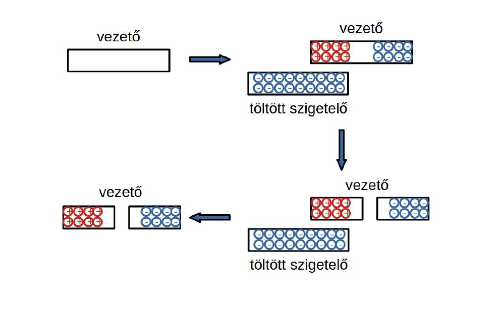
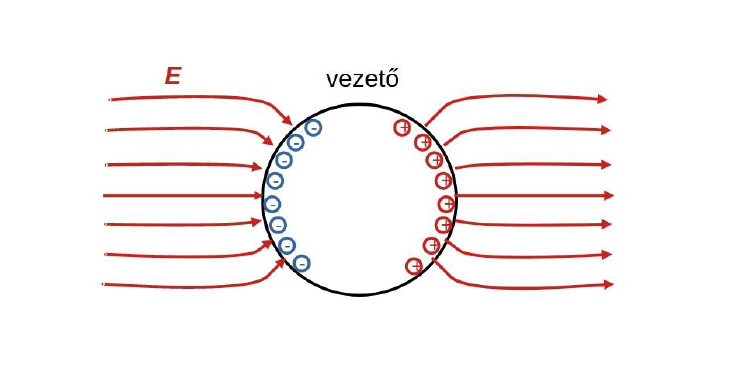

# Villamosságtan

# Tartalomjegyzék
2. [Általános tudnivalók](#általános-tudnivalók)
1. [Előadások](#előadások) \
    1.1 [1. előadás](#1-előadás)

# Általános tudnivalók

[Moodle](https://edu.vik.bme.hu/course/view.php?id=11643)

* Minden labort teljesíteni kell az aláíráshoz
    * Két mérés pótolható a pótlási héten
    * Van beugró
    * Mérési útmutató
    * Folyamatosan ellenőrizni kell, hogy meglett-e az adott labor
* Gyakorlatok nem kötelezőek
* Lesz vizsga
    * Egész sok számolás lesz
    * Vannak olyan anyagok, amik gyakorlaton nem jelennek meg, viszont a vizsgán kellenek
* Diasorból fel lehet készülni elvileg
* Két házi
    * Első házi feladat leadási határidő: április 26. 12:00.
    * Második házi feladat leadási határidő: május 24. 12:00.
    * Házi feladatok pótleadási határideje: május 31. 12:00.

**__Nem kötelezők a gyakok__**

# Vizsga
Az előadás anyagokban sorrendben előkerülő fogalmakat kilistáztam ide
* [Villamos töltés](./villamos-toltes.md)
* [Coulomb törvény](./coulomb-torveny.md)
* [Villamos erőtér](./villamos-eroter.md)
* [Villamos térerősség](./villamos-tererosseg.md)
* [Villamos erővonal](./villamos-erovonal.md)
* Pontszerű töltés villamos tere
    - A [Coulomb törvény](./coulomb-torveny.md) alapján
    - Q töltés [villamos tere](./villamos-tererosseg.md) gömbszimmetrikus
    - nagysága a töltéstől $r$ távolságra: $\frac{Q}{4 \pi \varepsilon_0 r^2}$
* Nyugvó töltések eloszlása
    - **Elektromosan semleges** állapot: az anyag tetszpleges térfogatelemének, molekuláris méretekig, az eredő töltése 0
    - **Feltöltött** állapot: az anyag nullától különböző eredő töltéssel rendelkezik
    - **Elektrosztatikus egyensúlyi** állapot: a töltések nyugalomban vannak
* [Villamos megosztás](./villamos-megosztas.md)
* [Villamos potenciál](./villamos-potencial.md)
* [Ekvipotenciális felület](./ekvipotencialis-felulet.md)
* [Feszültség](./feszultseg.md)
* [Eltolási vektor](./eltolasi-vektor.md)
* [Villamos tér fluxusa](./villamos-ter-fluxusa.md)
* [Gauss törvény](./gauss-torveny.md)
* Ha egy felület adott pontjában a felületi töltéssűrűség (felületegységben található töltésmennyiség) $\rho_A$, akkor ott $D = \rho_A$
* [Árnyékolás, földelés](./arnyekolas-foldeles.md)
* Térerősség éleknél, koronakisülés
    - Egyenetlen felületű töltött test esetén a felületi töltéssűrűség, így a [villamos térerősség](./villamos-tererosseg.md), a nagyobb [görbülettel](../tobbvaltozos-analizis/gorbulet.md) rendelkező felületrészeknél (élek, csúcsok) a legnagyobb

    - Ha a [térerősség](./villamos-tererosseg.md) nagysága meghalad egy bizonyos szintet, akkor a levegő ionizálódik, [koronakisülés](https://www.youtube.com/watch?v=CkjFJtMG5oY) jön létre. Ezt a jelenséget több alkalmazás is kihasználja (pl. elektrosztatikus festékszórás, fénymásolás)

* [Kapacitás](./kapacitas.md)
* [Kondenzátor](./kondenzator.md)
* [Villamos tér energiája](./villamos-eroter.md#energiája)
* [Síkkondenzátor lemezei között ható erő](./kondenzator.md#síkkondenzátor-lemezei-között-ható-erő)
* [Kondenzátorok kapcsolása](./kondenzator.md#kondenzátorok-kapcsolása)

# Előadások

## 1. Előadás

### Elektrosztatika

Ha két anyag töltése ugyanaz, akkor taszítják egymást, különben vonzzák
Töltés jellemzi az anyag tulajdonságát.

**Coulomb-törvény** 
$$ \underline{F} = \frac{1}{4 \pi \varepsilon_0} \frac{Q_1 \cdot Q_2}{r^2} $$

Töltés mértékegysége Coulomb

**Vákuum dielektromos állandója**
$$\varepsilon_0  = 8,85*10^{-12}$$

A töltés létrehoz maga körül egy teret (részecskékből/energiacsomagokból) és ez a tér fénysebességgel terjed a töltés körül

A két töltés egy közvetítő térrel hat kölcsön

**Villamos térerősség**

$\underline{E}= \frac{\underline{F}}{Q}$ - Az egységnyi pozitív pontszerű töltésre ható erő

$$ [E] = \frac{V}{m} $$

Erővonalakkal lehet szemléltetni

**Erővonal**
Tegyük fel, hogy belehelyezünk a térbe egy pozitív pontszerű egység töltést. Ekkor a töltés mozgása egy erővonalat ír le. Minél sűrűbbek a vonalak annál nagyobb a térerősség.

**Pontszerű töltés térerőssége**

$Q$ töltésű pontszerú térerőssége $r$ távolságra
$$E = \frac{1}{4 \pi \varepsilon_0} \frac{Q}{r^2}$$

**Töltésmegosztás**

Elektrosztatikus térbe helyezett vezető gömb esetén töltésmegosztás
jön létre. Amint az egyensúlyi állapot beáll, a gömb felülete töltötté
válik, a felületen az elektrosztatikus tér erővonalai merőlegesek a
felületre. A gömb belsejében a térerősség nulla.

**Villamos potenciál**

A tér egy adott `1` pontjának `0` referenciaponthoz képesti potenciálja: az a
munka, mely ahhoz szükséges, hogy egy pozitív egységnyi töltést a
villamos tér ellenében a referenciapontból az `1` pontba mozgassuk. A
referenciapont potenciálját 0-nak vesszük

$$ V_1 - V_0 = V_1 = - \int_0^1{\underline{E}d\underline{l}} = \int_1^0{\underline{E}d\underline{l}}$$

Differenciális alak:
$\nabla$ - vektor aminek minden koordinátája egy-egy deriválás
$$\nabla = (\frac{\partial}{\partial x}, \frac{\partial}{\partial y}, \frac{\partial}{\partial z})$$
$$\underline{E} = -\text{grad(V)}$$

$$[V] = V \text{(Volt)}$$

Elektrosztatikus tér esetén az útvonal nem számít csak a két pont helyzetétől

**Ekvipotenciális felület**

Azon pontok halmaza, amelyek azonos potenciálértékkel rendelkeznek

**Feszültség**

A feszültség ($U$) két pont közötti potenciálkülönbség

$$U_{12} = V_1 - V_2 = \int_1^2{\underline{E}d\underline{l}}$$

Magasabb-ból mutat az alacsonyabb felé

**Eltolási vektor**

$\underline{D}$, villamos tér jellemzésére használjuk a térerősség mellett

$$\underline{D}=\varepsilon_0 \underline{E}$$
$$[D] = \frac{C}{m^2}$$

**Térerősség fluxusa**

$$\Phi = \int_A{\underline{E}d\underline{A}}$$

**Felületi integrál**

