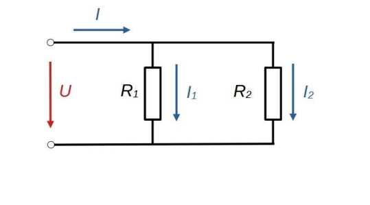

# Áramosztó

Az áram az áramosztó
alkalmazással osztható le a
kívánt értékre. • Az áramosztó két, párhuzamosan
kapcsolt ellenállásból áll. A
főágban folyó áram az
ellenállásokon, azok értékeinek
megfelelően, megoszlik. • A képlet ismerete áramkörök
modellezésénél is hasznos.

$$I_2 = \frac{R_1}{R_1+R_2}I$$