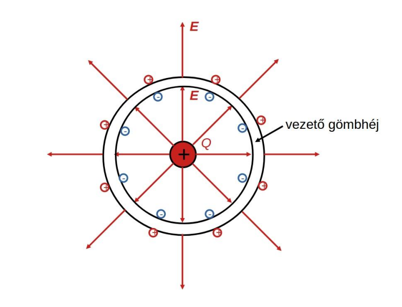
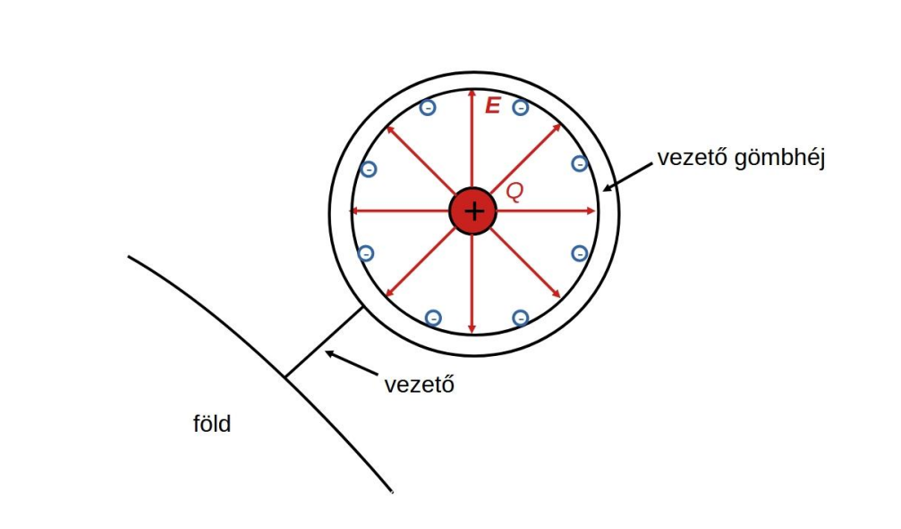

# Árnyékolás, földelés

Adott egy vezető gömbhéj, melynek középpontjába pozitív, pontszerű töltést helyezünk.
A gömbhélyon belül a tér megegyezik a pontszerű töltés terével
A héjon [töltésmegosztás](./villamos-megosztas.md) jön létre, a belső és külső felületen egyaránt a pontszerű töltés nagyságával megegyező össztöltés alakul ki, ellentétes előjellel, egyenletes töltéseloszlással.
A héjban a térerősség 0.
A héjon kívül a térerősség a pontszerű töltés terével egyezik meg, mintha a héj ott sem lenne.

Kössük össze a gömbhéjat egy annál sokkal nagyobb felületű vezetővel (pl. föld)! Ezt hívjuk földelésnek
Egyensúlyi állapotban a teljes rendszer (gömbhéj+vezeték+föld) [ekvipotenciális](./ekvipotencialis-felulet.md), a gömbhéj külső felületéről gyakorlatilag az összes töltés elvándorol a föld felületére.
A gömbhéjon kívül a [térerősség](./villamos-tererosseg.md) nulla, ez az **árnyékolás** jelensége.
Ezáltal egy villamos berendezés felületéről eltávolíthatóak a potenciálisan veszélyes töltések.
