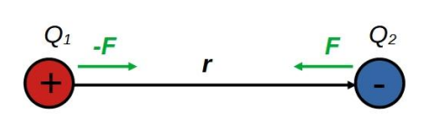

# Coulomb törvény

Az elektromos töltések közötti erőhatást a Coulomb törvény írja le:
$$\textbf{F} = \frac{1}{4 \pi \varepsilon_0} \frac{Q_1Q_2}{r^2} \frac{\textbf{r}}{r}$$

$Q_1$, $Q_2$ : vákumban elhelyezett elektromos töltések
$\textbf{r}$ : töltések távolságvektora
$e_0=8.85 \cdot 10^{-12} \frac{C}{Vm}$ : a vákum dielektromos állandója.

Ha az elrendezés egy adott anyagban van, akkor az adott anyag dielektromos állandóját kell használni.

