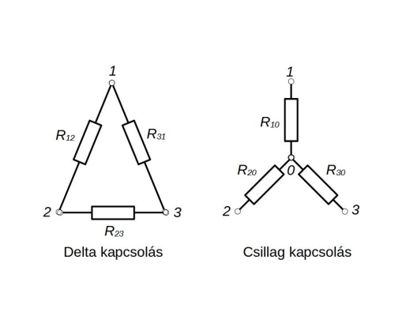

# Csillag-delta átalakítás

Ha az ellenállások csillag (Y), vagy delta (Δ) kapcsolásban vannak egy körben, az előző egyszerűsítési módszerek esetenként nem alkalmazhatóak, a csillag kapcsolást deltába, a deltát csillagba alakítva folytathatjuk az egyszerűsítést.

**Deltából csillagba**

$$R_{10} = \frac{R_{12}R_{31}}{R_{12}+R_{23}+R_{31}} \qquad R_{20} = \frac{R_{12}R_{23}}{R_{12}+R_{23}+R_{31}} \qquad R_{30} = \frac{R_{23}R_{31}}{R_{12}+R_{23}+R_{31}}$$

**Csillagból deltába**
$$G_{12} = \frac{G_{10}G_{20}}{G_{10}+G_{20}+G_{30}} \qquad G_{31} = \frac{G_{10}G_{30}}{G_{10}+G_{20}+G_{30}} \qquad G_{23} = \frac{G_{20}G_{30}}{G_{10}+G_{20}+G_{30}}$$

