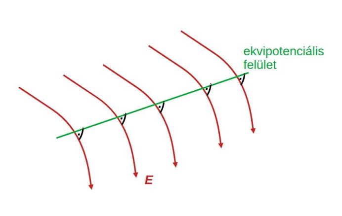
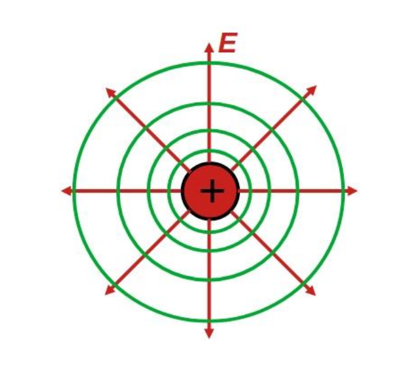

# Ekvipotenciális felület
Amint a neve is sugallja, az ekvipotenciális felület azon pontok halmaza, melyek azonos [potenciálértékkel](./villamos-potencial.md) rendelkeznek.
Töltést ekvipotenciális felületen mozgatva nincs munkavégzés.
A villamos térerősség a felület bármely pontjában **merőleges** az ekvipotenciális felületre.

Egy pontszerű töltés ekvipotenciális felületei, koncentrikus gömbök.

