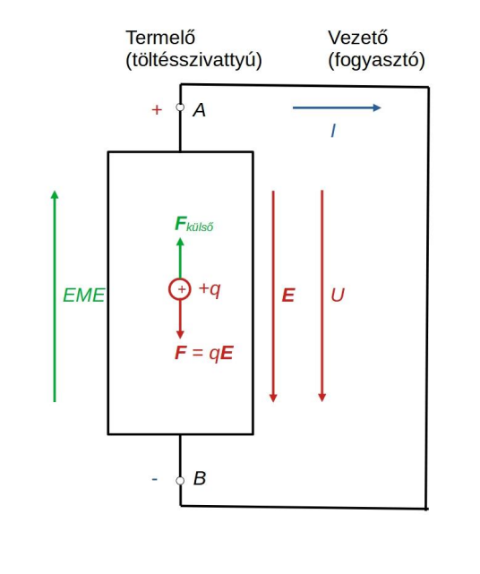

# Elektromotoros erő

A töltés-szétválasztó erő jellemzésére bevezetjük az elektromotoros erő (EME) fogalmát, melnyek mértékegysége a volt (V):
$$EME = \frac{\text{külső erő munkája}}{töltés} = \frac{\int_B^A \textbf{F}_{\text{külső}} d\textbf{l}}{q}$$

A töltéskülönbség miatt a termelő kapcsai között feszültség (U) alakul ki, mértékegysége a volt (V):

$$U = \frac{\text{villamos tér munkája}}{\text{töltés}} = \int_A ^B \textbf{E} d \textbf{l}$$

