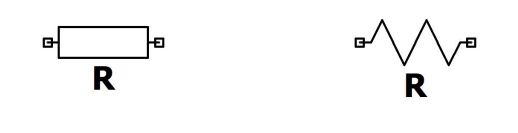

# Ellenállás

A vezetőben haladó mobilis töltések annak atomjaival folyamatosan ütköznek, a vezető ellenáálást tanúsít a töltések áramlásával szemben, melyet a villamos ellenállással (R) jellemzünk, melynek mértékegysége az ohm ($\Omega$).

Az ohmos ellenállás villamos energiát fogyaszt, amely hő formájában disszipálódik. Nem csak vezetőt, hanem bármelyik áramköri elemet, amely villamos energiát fogyaszt, modellezhetjük ohmos ellenállással.