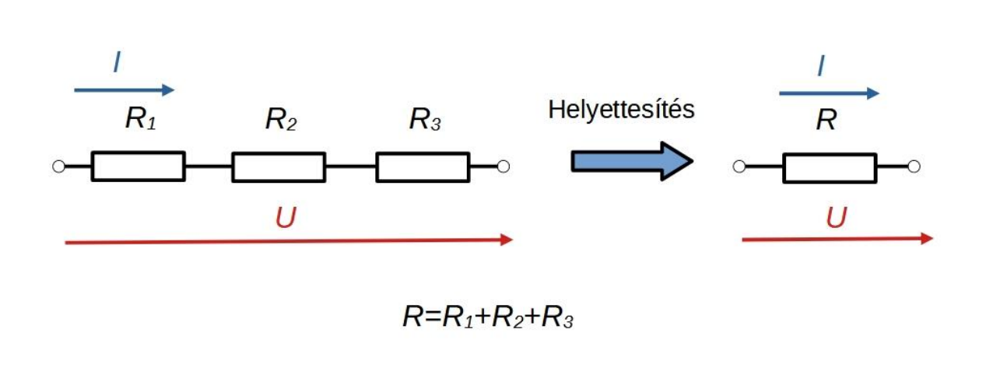

# Ellenállások soros kapcsolása

Az áramköri modellek egyszerűsíthetőek [ellenállások](./ellenallas.md) összevonásával.
A sorba kapcsolt [ellenállásokat](./ellenallas.md) helyettesíthetjük egyetlen ellenállással, melynnek ellenállása a többi ellenállás összege:
$$\sum_i R_i = R$$
