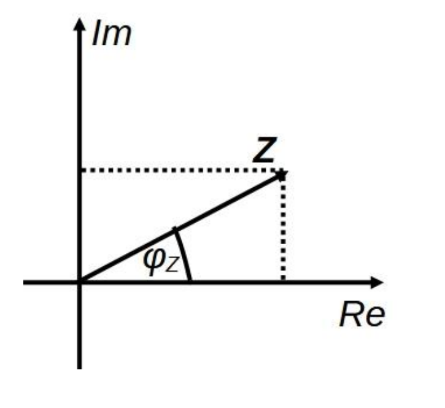

# Fázisszög

A [feszültség](./feszultseg.md) és áram közötti fáziseltolódást közvetlenül az [impedancia](./impedancia.md) ismeretéből is meghatározhatjuk.
Legyen egy áramkör, vagy áramköri elem kapcsaira vonatkozó [impedancia](./impedancia.md) $\bm{Z}$, akkor annak fázisszöge:
$$\varphi_Z = \text{atan} \left( \frac{\text{Im}(\bm{Z})}{\text{Re}(\bm{Z})} \right)$$

A kapcsokon eső [feszültség](./feszultseg.md) és a rajtuk átfolyó áram közti fáziseltolódás: $\varphi = -\varphi_Z$

