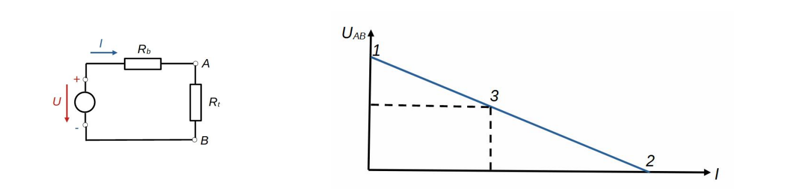

# Feszültségforrás jelleggörbéje

Nevezetes pontok:
1. Üresjárási pont: $R_t = \infty, I=0, U_{AB} = U_{max} = U_{üresjárási}, P = 0$
2. Rövidzárási pont: $R_t = 0, I = I_{max} = I_{rövidzárási} = U_{üresjárási}/R_b, U_{AB} = 0, P = 0$
3. Névleges pont: $R_t = R_{névleges}, I = I_{névleges}, U_{AB} = U_{névleges}, P = P_{névleges} = U_{névleges} \times I_{névleges}$