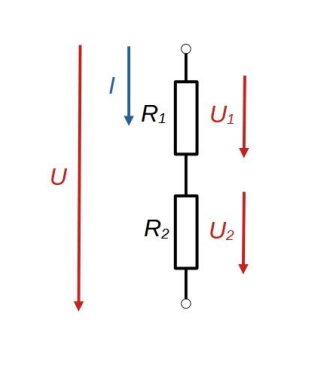

# Feszültségosztó

Abban az esetben, ha egy fogyasztó a tápfeszültségnél kisebb [feszültségen](./feszultseg.md) működik, a feszültségosztó nevű egyszerű, bár alacsony hatásfokú alkalmazással a tápfeszültség leosztható a kívánt értékre. 
A feszültségosztó két, sorba kapcsolt [ellenállásból](./ellenallas.md) áll. A körre kapcsolt [feszültség](./feszultseg.md) az [ellenállásokon](./ellenallas.md), azok értékeinek megfelelően, megoszlik. 
A képlet ismerete áramkörök modellezésénél is hasznos.

$$U_2 = IR_2 = U\frac{R_2}{R_1+R_2}$$