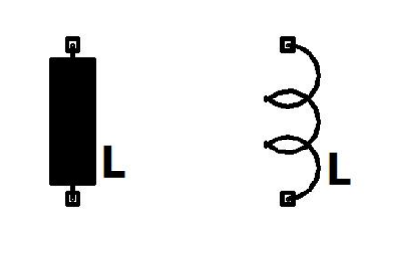

# Induktivitás

Villamos energiát tárol mágneses tér formájában.
Alkalmazása (tekercs): áramkörök feszültség- és áramviszonyainak beállítása váltakozóáramúesetben, váltakozó áramú komponens leválasztása egyenáramú jelről (fojtótekercs), szűrőáramkörökben, híradástechnikában, motorok áramköri modelljében is szerepel, stb.
Koncentrált paraméterű áramköri jelei:

**Jele**: L
**Mértékegysége**: [L] = henry = H
**Feszültség-áram karakterisztikája tetszőleges időfüggő esetben**: 
Egyenáramú esetben rövidzár.
$$u = L \frac{d\bm{i}}{dt}$$
A $\frac{d}{dt} = j\omega$ helyettesítéssel élve
$$u = j\omega L \bm{i}$$

[impedancia](./impedancia.md): $\bm{Z_L} = j L \omega$
[reaktancia](./reaktancia.md): $\bm{X_L} = L \omega$
[admittancia](./admittancia.md): $\bm{Y_L} = \frac{1}{\bm{Z_L}} = -\frac{j}{L\omega}$

