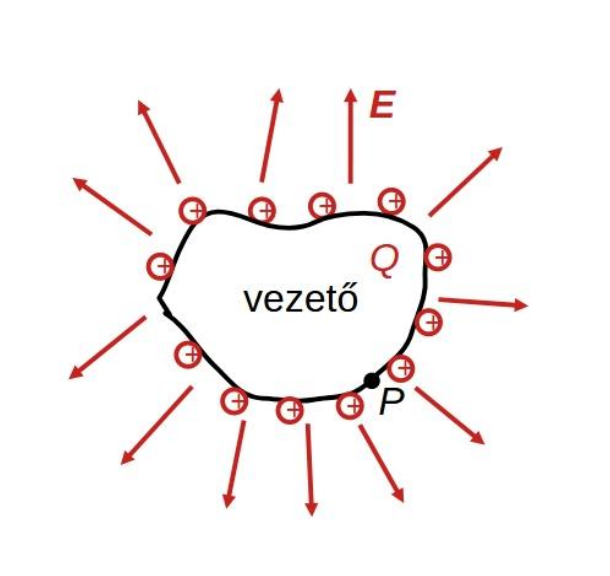
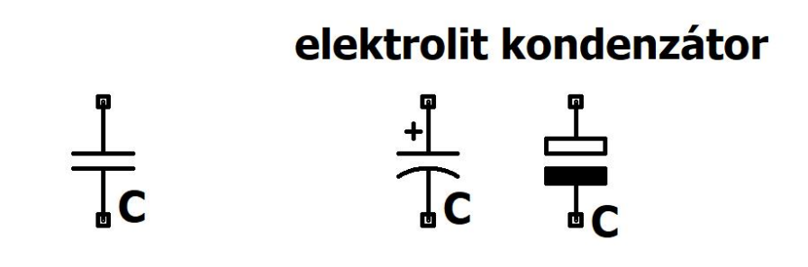

# Kapacitás

A kapacitás (C) vezető elrendezés töltéstároló képességét jellemzi.
$$V = V - V (\infty) = \int_P^\infty \textbf{E} d \textbf{l} \sim Q$$ 
$$V = \frac{1}{C} Q$$

**Jele**: C
**Mértékegysége**: [C] = farad = F = $\frac{C}{V}$

## Mint áramköri elem
Villamos energiát tárol elektromos tér formájában.
Alkalmazása (kondenzátor): áramkörök feszültség- és áramviszonyainak beállítása váltakozóáramúesetben, villamos energia tárolás (szuperkapacitás), egyenáramú komponens leválasztásaváltakozóáramú jelről, meddő kompenzáció motoroknál, szűrő áramkörökben, híradástechnikában, stb.
Koncentrált paraméterű áramköri jelei:

**Feszültség-áram karakterisztikája tetszőleges időfüggő esetben**:
$$i = C \frac{du}{dt}$$

Egyenáramú esetben szakadás.
