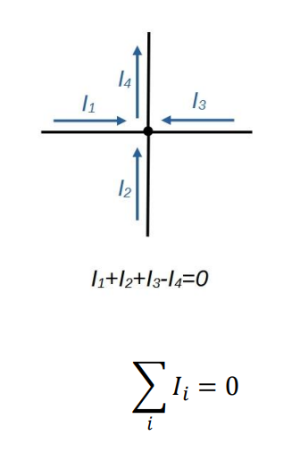

# Kirchhoff csomóponti törvénye

Ha egy áramkörben a vezetékek egy csomópontban találkoznak, a csomópontba befolyó, illetve onnan kifolyó áramok előjeles eredője nulla. Ez a töltés megmaradás elvéből következik. Az áramokat előjelezhetjük úgy, hogy a befolyó áramok pozitív, a kifolyó áramok negatív előjelűek, de akár fordított előjelezést is használhatunk.

