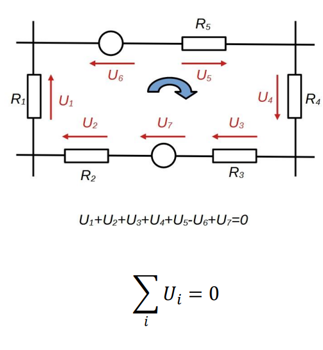

# Kirchhoff hurok törvénye

Áramkörben található hurok esetén a hurokban található áramköri elemeken eső [feszültségek](./feszultseg.md) előjeles eredője nulla. Az előjelezést az általunk választott körüljárási irányhoz viszonyítjuk, mely lehet az óramutató járásával megegyező, vagy ellentétes. Ha a [feszültség](./feszultseg.md) egyezik a körüljárási iránnyal, pozitívnak, ha ellentétes, akkor negatívnak vesszük.

