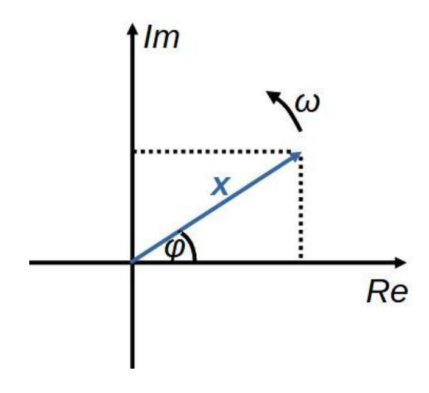

# Komplex időfüggvény

Az áramkörben előforduló szinuszos mennyiségeket ($\textbf{x}$) komplex időfüggvényekkel írjuk le, mert ezáltal linearizálhatóak lesznek a [kapacitív](./kapacitas.md), illetve [induktív](./induktivitas.md) áramköri elemek differenciál egyenletei. A komplex időfüggvény ($\textbf{X}_m$ a komplex amplitúdó, $j$ az imaginárius, $\omega$ a körfrekvencia):
$$\textbf{x} = \textbf{X}_m e^{j \omega t}$$

A komplex időfüggvényt az [Euler-összefüggés](https://hu.wikipedia.org/wiki/Euler-%C3%B6sszef%C3%BCgg%C3%A9s) segítségével $a+jb$ alakba tudjuk írni.
\[
\bm{x} = \bm{X_m} e^{j \omega t} = X_m e^{j \varphi} e^{j \omega t} = X_m e^{j (\omega t + \varphi)} = X_m \cos(\omega t + \varphi) + j X_m \sin(\omega t + \varphi)
\]

\[
X_m = \sqrt{\left( \text{Re}(\bm{X_m}) \right)^2 + \left( \text{Im}(\bm{X}_m) \right)^2}
\]

A komplex időfüggvény nagy segítséget jelent a szinuszosan táplált, [kapacitív](./kapacitas.md), illetve [induktív](./induktivitas.md) (össszefoglaló nevén reaktív) elemeket is tartalmazó áramkörök számítása esetén, de az eredményként kapott áramokat és [feszültségeket](./feszultseg.md) végül akár átírhatjuk valós időfüggvényes alakba is. A komplex időfüggvény matematikai segítség, de a valós időfüggvényes alak az, amit fizikailag megtapasztalunk.

A komplex időfüggvény valós időfüggvényes alakja az $a + jb$ alakba átírt függvény valós része

\[
\bm{x} = \bm{X_m} e^{j \omega t} = X_m \cos(\omega t + \varphi) + j X_m \sin(\omega t + \varphi)
\]

\[
x = X_m \cos(\omega t + \varphi)
\]