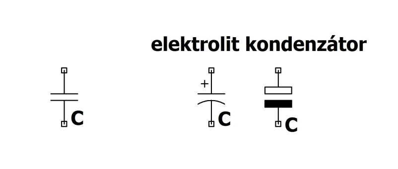

# Kondenzátor

A kondenzátor két vezetőből (fegyverzet) álló elrendezés. A fegyverzetek közé [feszültséget](./feszultseg.md) kapcsolva azok ellentétesen feltöltődnek, közöttük [villamos tér](./villamos-eroter.md) alakul ki.

$$U = V_+ - V_- = \int_{P_+}^{P_-} \textbf{E} d \textbf{l} \sim Q$$

A kondenzátor alapegyenlete:
$$Q = CU$$
avagy "kucu"

$Q$ : [töltés](./villamos-toltes.md)
$C$ : [kapacitás](./kapacitas.md)
$U$ : [feszültség](./feszultseg.md)

A kondenzátor energiatároló elem, a villamos energiát [villamos tér](./villamos-eroter.md) formájában tárolja. A fegyverzetekre kapcsolt [feszültség](./feszultseg.md) feltölti, a tárolt energia pedig kinyerhető, ha azokat egy vezető segítségével (vezeték) fogyasztóhoz kötjük (a kondenzátor "kisül", a töltéskülönbség kiegyenlítődik).
Egy alkalmazási példa a [szuperkapacitás](https://www.youtube.com/watch?v=zEahoJZgfys), mely nagy villamos energia tárolására alkalmas, előnye például, hogy gyorsan feltölthető és nagy energiát képes leadni rövid idő alatt.
A kondenzátornak számos további alkalmazása van (például az elektronikában)

**Áramköri jele**

## Síkkondenzátor

A síkkondenzátor két, egymással párhuzamo síklemezből áll, $A$ a lemezek felülete, $s$ a két lemez távolsága, $l$ a lemezek hossza
Feltöltött esetben a két lemez között jó közelítéssel homogén [villamos tér](./villamos-eroter.md) alakul ki.

### Kapacitása
Alkalmazzuk a [Gauss törvényt](./gauss-torveny.md) az $A_1$ téglatest alakú zárt felületre, ahol a lemezzel párhuzamos felületelemek területe megegyezik a lemezével, az egyik felületelem a lemez belsejében van, a négy másik felületelem a lemezre merőleges.

$$\int_{A_1} \varepsilon_0 \textbf{E} d \textbf{A} = Q$$

Mivel a zárt felületnek csak a két lemez között haladó, a lemezzel párhuzamos komponensére nem nulla az integrál értéke (a lemezen belül haladó felületelem esetén a [térerősség](./villamos-tererosseg.md) nulla, a többi felületelem esetén a [térerősség](./villamos-tererosseg.md) párhuzamos a felülettel):

$$\int_{A_1}\varepsilon_0 \textbf{E} d \textbf{A} = \int_{A}\varepsilon_0 \textbf{E} d \textbf{A} = \int_{A}\varepsilon_0 E d A = \varepsilon E A = Q$$

Másrészt a [feszültség](./feszultseg.md) definíciójának felhasználásával (a $P_+$ és $P_-$ pontokat egymással szemben felvéve, a térerősséggel párhuzamos útvonalon integrálva a villamos térerősséget):

$$U = V_+ - V_- = \int_{P_+}^{P_-} \textbf{E} d \textbf{l} = \int_{P_+}^{P_-} E d l = Es$$

Ezekből az összefüggésekből és a $Q=CU$ képletet felhasználva:
$$C = \varepsilon_0 \frac{A}{s}$$

### Síkkondenzátor lemezei között ható erő
Feltöltött [síkkondenzátor](#síkkondenzátor) lemezei köztt $\textbf{F}_{\textbf{e}}$ vonzó erőhatás lép fel. Az $\textbf{F}_{\textbf{e}}$ erő hatására $ds$-el elmozduló lemezen a tér által végzett munka:
$$dW_e = F_eds$$
A munkavégzés hatására a lemezek köztti tér energiájának csökkenése:
$$dW_e = w_eAds$$
A fenti egyenletek egyenlőségéből:
$$F_e = w_eA$$

## Kondenzátorok kapcsolása

### Sorba

Egymással sorba kapcsolt kondenzátorok helyettesíthetőek egyetlen $C_s$ kapacitású kondenzátorral, ahol $\frac{1}{C_s} = \sum_{i=1}^n \frac{1}{C_i}$

### Párhuzamosan

Egymással párhuzamosan kapcsolt kondenzátorok helyettesíthetőek egyetlen $C_p$ kapacitású kondenzátorral, ahol $C_p = \sum_{i=1}^n C_i$

