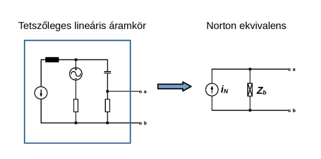

# Norton tétel

Bármely lineáris villamos hálózat két kapocs felől helyettesíthető egy valós áram-generátorral. A hálózat állhat például feszültség-, illetve áramforrásokból, valamint ellenállásokból, vagy egy frekvenciájú szinuszos forrásokból és impedanciákból.

A helyettesítő kép árama, $i_N$ megegyezik az eredeti áramkör a-b kapcsai közötti rövidzárási árammal. Ezt akár méréssel is meghatározhatjuk.
A helyettesítő kép belső [impedanciája](./impedancia.md), $Z_b$ kétféle módon is meghatározható:
1. Az eredeti körben található feszültség-generátorokat ideális vezetékszakasszal, az áram-generátorokat pedig szakadással helyettesítjük. Az így kapott impedancia-hálózat a-b kapcsokra vonatkozó eredője $\bm{Z_b}$.
2. Az eredeti kör a-b kapcsait szabadon hagyva meghatározzuk a kapcsok közötti üresjárási feszültséget. Az üresjárási feszültség és rövidzárási áram hányadosa $\bm{Z_b}$. Ez méréssel is megállapítható.