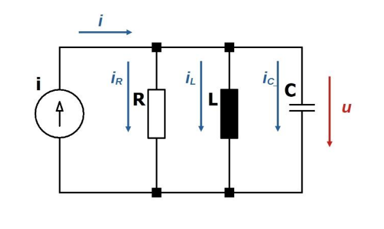

# Párhuzamos R-L-C kör

Sávzáró szűrőként alkalmazzák.
A kör [admittanciája](./admittancia.md): $\bm{Y} = G + \bm{Y_C} + \bm{Y_L} = \frac{1}{R} + jC\omega-\frac{j}{L\omega} = \frac{1}{R}+j(C\omega - \frac{1}{L\omega})$

Emlékeztető: $G$ a [vezetőképesség](./vezetokepesseg.md)

Rezonancia: ha a [kapacitív](./kapacitas.md) és [induktív](./induktivitas.md) [impedanciák](./impedancia.md) nagyságai megegyeznek, a [kapacitív](./kapacitas.md) és [induktív](./induktivitas.md) impedanciák kiejtik egymást.Ekkor a kör tisztán ohmos, $Y = G$, az [admittancia](./admittancia.md) minimális, a főágban folyó áram minimális.

A rezonancia frekvencia a $C\omega = \frac{1}{L\omega}$ feltételből:
$$f = \frac{1}{2 \pi \sqrt{LC}}$$