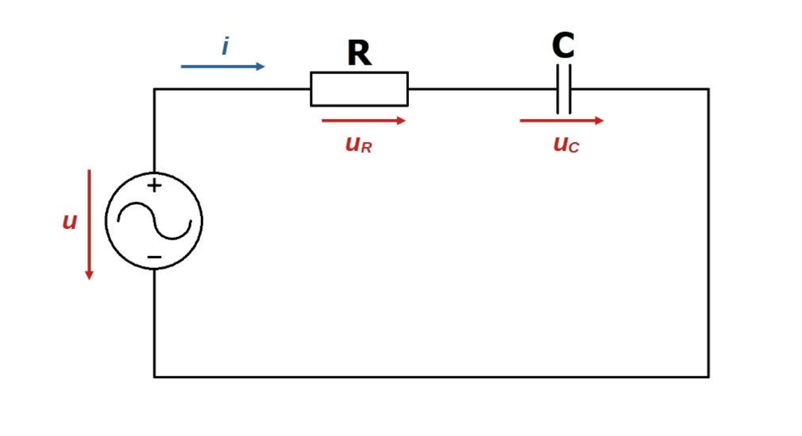
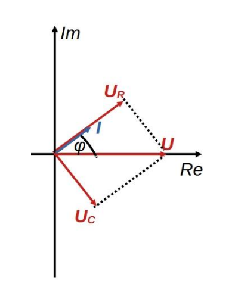

# Soros R-C kör
Az alábbi áramkör egy [R ellenállás](./ellenallas.md) és [C kapacitás](./kapacitas.md) soros kapcsolásából áll. A kört az elektronikában szűrőként is alkalmazzák.

Az áramkör impedanciája a feszültségforrás felől nézve: 
\[
\bm{Z} = R - \frac{j}{C \omega}
\]

Az u és i közötti fáziseltolódás:
\[
\varphi = \text{atan}\left(\frac{1}{RC\omega}\right)
\]

- A fázisszög pozitív, az áram siet a [feszültséghez](./feszultseg.md) képest.
- Az áramkör [kapacitív](./kapacitas.md) jellegű.
- Minél kisebb a frekvencia, annál inkább a tisztán kapacitívhoz, minél nagyobb a frekvencia, annál inkább a tisztán ohmoshoz közelít a kör.
- Kis frekvenciák esetén a [feszültség](./feszultseg.md) nagyobb része a kapacitáson, nagy frekvenciáknál pedig az [ohmos ellenálláson](./ellenallas.md) esik. Abban az esetben, ha az áramkör bemenete a körre kapcsolt feszültség, kimenete az ellenálláson eső feszültség, felüláteresztő szűrőt kapunk frekvencia szempontjából. Ha a kimenet a kapacitáson eső feszültség, aluláteresztő szűrőt kapunk.

A [vektorábra](./vektorabra.md) könnyen megszerkeszthető. Vegyük azt az időpillanatot, amikor a tápláló [feszültségnek](./feszultseg.md) csak valós értéke van. Ehhez képest az áram \(\varphi\) szöggel siet. Az [ellenálláson](./ellenallas.md) eső feszültség azonos fázisban van a körön átfolyó árammal, a [kapacitáson](./kapacitas.md) eső feszültség pedig \(\varphi = -90 \degree\)-kal késik ahhoz képest. \(U_R\) és \(U_C\) vektoros eredője egyenlő kell legyen \(U\)-val.

