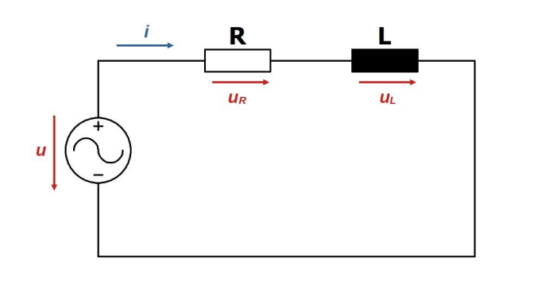
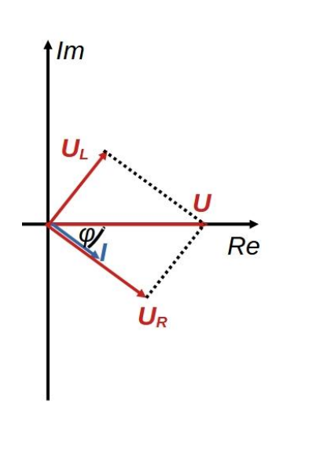

# Soros R-L kör

Ezen típusú áramkör villanymotorok modellezésénél gyakran elő fog kerülni, mivel ezek a berendezések tekercseket tartalmaznak, melyek [induktivitással](./induktivitas.md) rendelkeznek. A kört az elektronikában szűrőként is alkalmazzák.
A kör [impedanciája](./impedancia.md) a feszültségforrás felől nézve: $\bm{Z} = R+jL\omega$
Az u és i közötti [fáziseltolódás](./fazisszog.md): $\varphi = - \text{atan}\left(\frac{L \omega}{R}\right)$
A [fázisszög](./fazisszog.md) negatív, a [feszültség](./feszultseg.md) siet az áramhoz képest. 
Az áramkör [induktív](./induktivitas.md) jellegű. 
Minél kisebb a frekvencia, annál inkább a tisztán ohmoshoz, minél nagyobb a frekvencia,annál inkább a tisztán [induktívhoz](./induktivitas.md) közelít a kör. 
Kis frekvenciák esetén a [feszültség](./feszultseg.md) nagyobb része az [ohmos ellenálláson](./ellenallas.md), nagy frekvenciáknál pedig az [induktivitáson](./induktivitas.md) esik. Abban az esetben, ha az áramkör bemenete a körre kapcsolt [feszültség](./feszultseg.md), kimenete az ellenálláson eső [feszültség](./feszultseg.md), aluláteresztő szűrőt kapunk frekvencia szempontjából. Ha a kimenet az [induktivitáson](./induktivitas.md) eső [feszültség](./feszultseg.md), felüláteresztő szűrőt kapunk.
A [vektorábra](./vektorabra.md) könnyen megszerkeszthető. Vegyük azt az időpillanatot, amikor a tápláló [feszültségnek](./feszultseg.md) csak valós értéke van. Ehhez képest az áram $\varphi$ szöggel késik. Az [ellenálláson](./ellenallas.md) eső [feszültség](./feszultseg.md) azonos fázisban van a körön átfolyó árammal, az [induktivitáson](./induktivitas.md) eső [feszültség](./feszultseg.md) pedig $\varphi = 90 \degree$-kal siet ahhoz képest. $U_R$ és $U_L$ vektoros eredője egyenlő kell legyen $U$-val.

