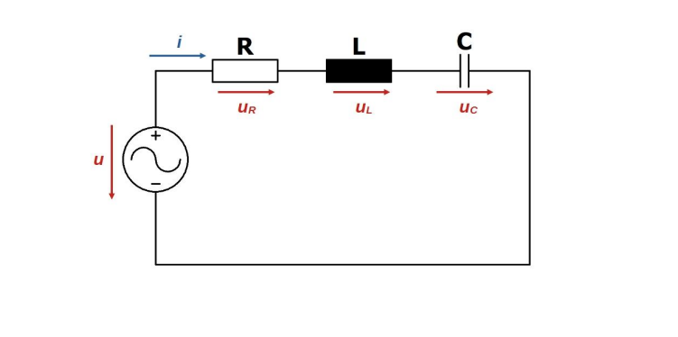

# Soros R-L-C kör

Sáváteresző szűrőként is alkalmazzák.

[Impedanciája](./impedancia.md): $\bm{Z} = R+jL\omega - \frac{j}{C \omega} = R+j(L \omega - \frac{1}{C \omega})$

**Rezonancia**: ha a [kapacitív](./kapacitas.md) és [induktív](./induktivitas.md) [reaktanciák](./reaktancia.md) megegyeznek, a [kapacitív](./kapacitas.md) és [induktív](./induktivitas.md) [impedanciák](./impedancia.md) kiejtik egymást. Ekkor a kör tisztán ohmos, $\bm{Z} = R$, az [impedancia](./impedancia.md) minimális, a körben folyó áram maximális.
A rezonancia frekvencia az $L\omega = \frac{1}{C\omega}$ feltételből:
$$f = \frac{1}{2\pi \sqrt{LC}}$$