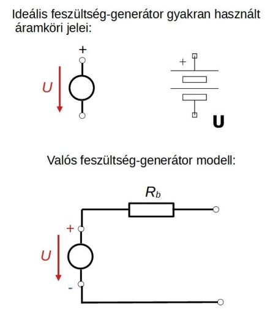
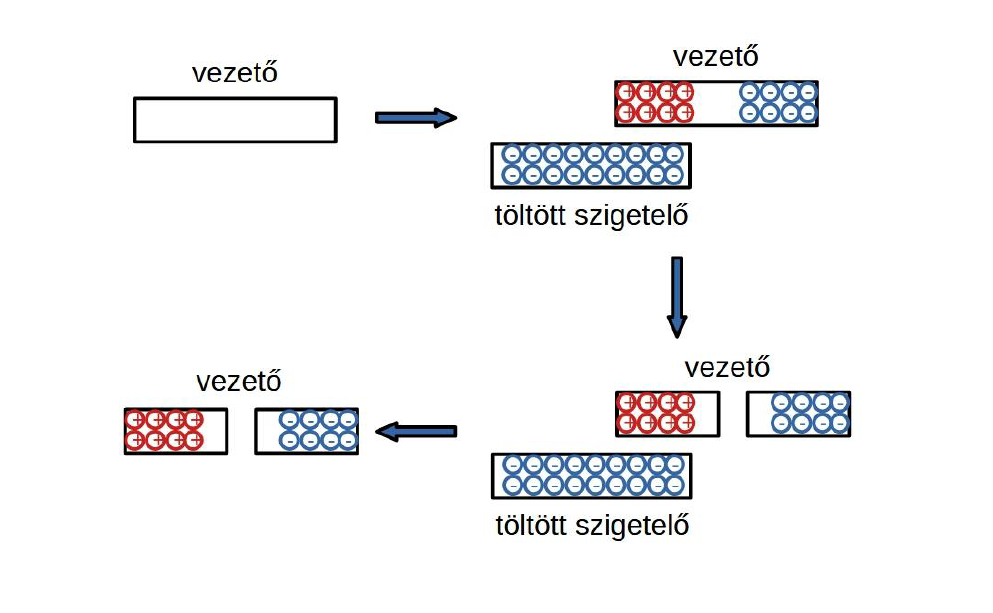

# Termelő modellezése

## Feszültség-generátor modell
A termelőt egy sorba kapcsolt ideális feszültség-generátor (az általa szolgáltatott [feszültség](./feszultseg.md) ($U$), független a rajta átfolyó áram irányától és nagyságától) és belső ellenállás ($R_b$) koncentrált paraméterű áramköri modelljével helyettesítjük.

## Áram-generátor modell:
A termelőt egy párhuzamosan kapcsolt ideális áram-generátor (az általa szolgáltatott áram ($I$) független a kapcsai közötti [feszültség](./feszultseg.md) nagyságától és irányától) és belső ellenállás ($R_b$) koncentrált paraméterű áramköri modelljével helyettesítjük.
