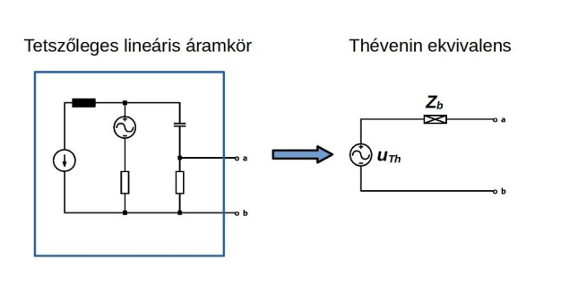

# Thévenin tétel

Bármely lineáris villamos hálózat két kapocs felől helyettesíthető egy valós feszültség-generátorral. A hálózat állhat például feszültség-, illetve áramforrásokból, valamint ellenállásokból, vagy egy frekvenciájú szinuszos forrásokból és impedanciákból.

A helyettesítő kép feszültsége, $u_{Th}$ megegyezik az eredeti áramkör a-b kapcsai közötti üresjárási feszültséggel. Ezt akár méréssel ismeghatározhatjuk.
A helyettesítő kép belső impedanciája, $Z_b$ kétféle módon is meghatározható:
1. Az eredeti körben található feszültség-generátorokat ideális vezetékszakasszal, az áram-generátorokat pedig szakadással helyettesítjük. Az így kapott impedancia-hálózat a-b kapcsokra vonatkozó eredője $\bm{Z_b}$.
2. Az eredeti kör a-b kapcsait rövidre zárjuk és meghatározzukakapcsok között átfolyó rövidzárási áramot. Az üresjárási feszültség és rövidzárási áram hányadosa $\bm{Z_b}$. Ez méréssel is megállapítható.