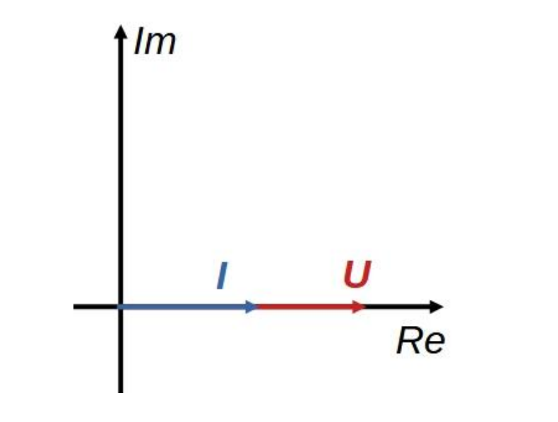
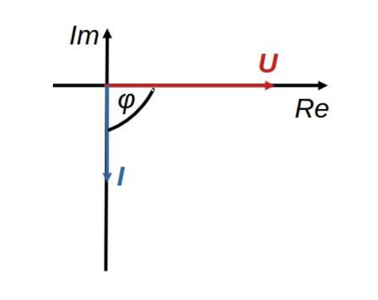
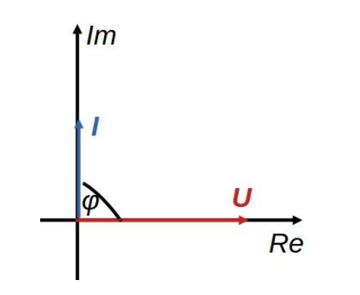

# Vektorábra

Adott áramkörben előforduló áramok és [feszültségek](./feszultseg.md) [komplex időfüggvényeit](./komplex-idofuggveny.md) ábrázolhatjuk egy tetszőleges időpillanatban a komplex számsíkon. Ezt hívjuk vektorábrának, mely hasznos vizuális információkat szolgáltat az áramkör működésével kapcsolatban. A vektorábrán általában a [komplex időfüggvények](./komplex-idofuggveny.md) komplex [effektív értékeit](./effektiv-ertek.md) ábrázoljuk.

## Ellenállás vektorábrája

Legyen az [ellenálláson](./ellenallas.md) eső [feszültség](./feszultseg.md): $\bm{u} = U_m e^{j\omega t}$
A rajta átfolyó áram: $\bm{i} = \frac{\bm{u}}{R} = \frac{U_m}{R} e ^{j \omega t}$
A [feszültség](./feszultseg.md) és áram valós időfüggvényes alakja:
$u = U_m \cos(\omega t) \qquad i = \frac{U_m}{R} \cos(\omega t)$
Az [Ohmos ellenállás](./ellenallas.md) esetén a [feszültség](./feszultseg.md) és áram mindig azonos fázisban van, a köztük lévő fáziseltolódás, $\varphi = 0$

## Induktivitás vektorábrája

Legyen az [induktivitáson](./induktivitas.md) eső [feszültség](./feszultseg.md): $\bm{u} = U_m e^{j \omega t}$
A rajta átfolyó áram: $\bm{i} = \frac{\bm{u}}{\bm{Z_L}} = \frac{U_m}{jL\omega} e^{j\omega t} = -\frac{j U_m}{L \omega} e ^{j\omega t} = \frac{U_m}{L \omega}e^{-j \frac{\pi}{2}} e^{j\omega t} = \frac{U_m}{L \omega} e^{j(\omega t - \frac{\pi}{2})}$
A [feszültség](./feszultseg.md) és áram valós időfüggvényes alakja:
$u = U_m\cos(\omega t) \qquad i = \frac{U_m}{L \omega} \cos(\omega t - \frac{\pi}{2})$
Tehát látható, hogy az áram a feszültséghez képest $\varphi = -90 \degree$-kal késik.

## Kapacitás vektorábrája

Legyen az [kapacitáson](./kapacitas.md) eső [feszültség](./feszultseg.md): $\bm{u} = U_m e^{j \omega t}$
A rajta átfolyó áram: $\bm{i} = \frac{\bm{u}}{\bm{Z_C}} = j\omega C U_m e^{j\omega t} = C \omega U_m e^{j(\omega t+\frac{\pi}{2})}$
A [feszültség](./feszultseg.md) és áram valós időfüggvényes alakja:
$u = U_m\cos(\omega t) \qquad i = U_mC \omega \cos(\omega t + \frac{\pi}{2})$
Tehát látható, hogy az áram a feszültséghez képest $\varphi = 90 \degree$-kal siet.
