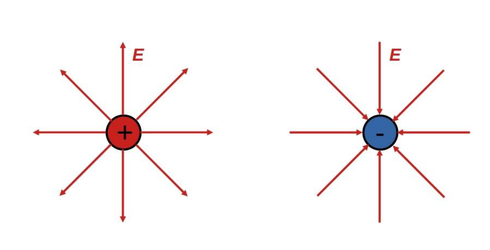

# Villamos erővonal

A [villamos térbe](./villamos-eroter.md) helyezett töltés gyorsulás nélkül a rá ható erő irányában mozogva erővonalat ír le. Az erővonal iránya a **pozitív** töltések mozgásának iránya.
Az erővonalak sűrűsége arányos a [térerősség](./villamos-tererosseg.md) nagyságával.
Az erővonalak pozitív töltésekből indulnak, negatív töltésekben végződnek.

