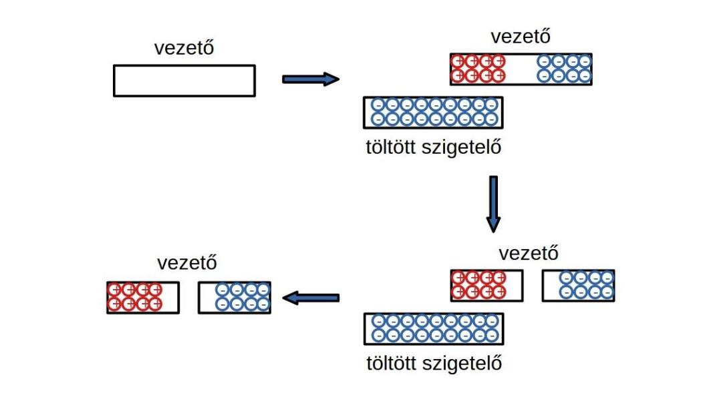

# Villamos megosztás

Elektrosztatikus térbe helyezett vezető gömb esetén töltésmegosztás jön létre. Amint az egyensúlyi állapot beáll, a gömb felülete töltötté válik, a a felületen az elektrosztatikus tér erővonalai merőlegesek a felületre. A gömb belsejében a térerősség nulla.

**Magyarázat az ábrához**
Látható, hogy az [erővonalak](./villamos-erovonal.md) balról jobbra haladnak, tehát egy egységnyi pozitív töltés ezt az utat próbálná követni ebben az [erőtérben](./villamos-eroter.md). Mivel a pozitív töltések nem tudják elhagyni a gömböt, ezért addig követik ezt az útvonalat, amíg csak tudják. A negatív töltések a pozitív töltésekkel ellentétes utat választanak, amit szintén addig követnek, amíg csak tudnak.