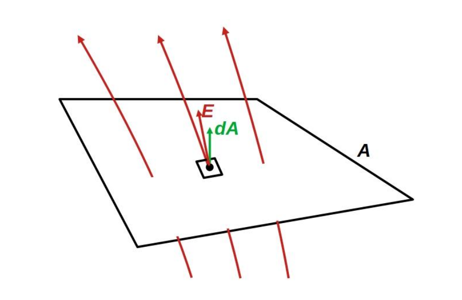

# Villamos tér fluxusa

A [villamos térerősség](./villamos-tererosseg.md) fluxusa ($\Phi_E$) adott felületre éretelmezendő, megegyezik a [térerősség](./villamos-tererosseg.md) $A$ felületre vett [felületi integráljával](../tobbvaltozos-analizis/feluleti-integral.md):

$$\Phi_E = \int_A \textbf{E} d \textbf{A}$$

**Szemléletesen**: egy adott kis felületdarabon átmenő [erővonalak](./villamos-erovonal.md) száma.

